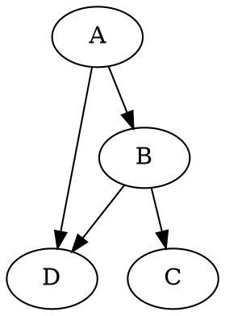

Bazel's [depset](https://bazel.build/extending/depsets) is a powerful construct for managing transitive dependencies efficiently. While it's commonly used in complex rules and providers, sometimes a simple use case can illuminate its utility.

Ok... but what does that meah? 🤔

> This is a companion post to [Jay Conrad](https://github.com/jayconrod) excellent series on [writing rules](https://jayconrod.com/posts/107/writing-bazel-rules--library-rule--depsets--providers). The series is excellent and I recommend you read it 🤓.

Consider this simple guide for understanding `depset`. We will be writing a simple ruleset `rules_graphviz`.

[Graphviz](https://graphviz.org/) is an open source graph visualization software. Graphs are defined via the `DOT` language which is a grammar for defining Graphviz nodes, edges, graphs.

For instance, let's take the simple graph _G_ below.



Would produce the following visualization.

```
┌───┐     ┌───┐
│ D │ ◀── │ A │
└───┘     └───┘
  ▲         │
  │         │
  │         ▼
  │       ┌───┐
  └────── │ B │
          └───┘
            │
            │
            ▼
          ┌───┐
          │ C │
          └───┘
```

Our goal would be to write a Bazel rule that let's us model this graph purely in Bazel targets.


```python
load("@rules_graphviz//:dot.bzl", "node")

node(
  name = "A",
  edges = [
    ":B",
    ":D",
  ],
)

node(
  name = "B",
  edges = [
    ":C",
    ":D",
  ],
)

node(name = "C")

node(name = "D")
```

We would like a _rule_ that creates a text file (_dot file_) of the `digraph` representation of all the nodes reachable from
the given target.

That means every node should know it's _dependencies_ (i.e. edges), and we'd like a way to traverse the whole graph.

💡 We could do this traversal with a standard algorithm (i.e. _breadth-first-search_) knowing only the direct edges, however, this is where `depset` shines, as it's a space and time effecient way of encoding a graph. The `depset` API contains a `to_list()` function making it easy to quickly iterate over **the whole graph**.

First, let's define our unique [provider](https://bazel.build/extending/rules#providers). Providers are a way for us to attach additional metadata
to every target in Bazel that they can carry along with them.

We will need two pieces of information: a _fragment_ of text which are the immediate edges of this target and a _depset_ which is the subgraph of targets it depends on. 


```python

GraphvizProviderInfo = provider(
  doc = "A provider for graphviz",
  fields = {
    "fragment": "The edges of this target to it's strict dependencies",
    "deps": "A depset of the dependencies of this target",
  },
)
```

Let's create our rule. We make it clear to Bazel that all targets provided to `edges` must carry with them our provider `GraphvizProviderInfo`.
Failure to add an edge which doesn't have this provider, will be an evaluation error.

```python
node = rule(
  implementation = _node_impl,
  attrs = {
    "edges": attr.label_list(
      doc = "Edges to other Graphviz nodes.",
      providers = [GraphvizProviderInfo],
    ),
  },
  output_to_genfiles = True,
)
```

Now the implementation purpose is to construct each node's fragment (i.e. direct edges) and also collect all fragment's of each node reachable from
the graph when constructing the final DOT graph.

Two _key lines_ are when the rule constructs `transitive_deps` and `transitive_fragments`.

`transitive_deps`
: We need to construct and propagate the new `depset` for the given node. We pass the immediate edges as the `direct` dependencies and each direct dependencies
own `depset` into the `transitive` attribute. This will create our graph bottom-up!

`transitive_fragments`
: This is where the rule iterates over all reachable nodes in the graph. We could do a traditional traversal, but the appeal of `depset` is that it offers
a `to_list()` API that provides the traversal for us -- while still giving us all the other space & time efficiencies.

```python
def _graphviz_impl(ctx):
  # Generate the DOT fragment for the current node
  fragment = '"{}"\n'.format(ctx.label)
  fragment += ''.join(
    ['"{}" -> "{}"\n'.format(ctx.label, dep.label) for dep in ctx.attr.edges]
  )

  # Aggregate transitive dependencies using depset
  transitive_deps = depset(
    direct=ctx.attr.edges,
    transitive=[dep[GraphvizProviderInfo].deps for dep in ctx.attr.edges]
  )

  # Concatenate all fragments from transitive dependencies
  transitive_fragments = ''.join(
    [dep[GraphvizProviderInfo].fragment for dep in transitive_deps.to_list()]
  )

  # Assemble the complete DOT content
  dot_content = "digraph G {\n"
  dot_content += fragment
  dot_content += transitive_fragments
  dot_content += "}\n"

  # Declare and write the DOT file
  dot_file = ctx.actions.declare_file(ctx.attr.name + ".dot")
  ctx.actions.write(dot_file, dot_content)

  # Return the providers
  return [
    DefaultInfo(files=depset([dot_file])),
    GraphvizProviderInfo(fragment=fragment, deps=transitive_deps),
  ]
```

Let's try our new rule using the targets earlier!

```bash
> bazel build //:A
Target //:A up-to-date:
  bazel-bin/A.dot

> cat bazel-bin/A.dot
digraph G {
"@@//:A"
"@@//:A" -> "@@//:B"
"@@//:A" -> "@@//:D"
"@@//:C"
"@@//:D"
"@@//:B"
"@@//:B" -> "@@//:C"
"@@//:B" -> "@@//:D"
}
```

Huzzah! We built a small declarative graph ruleset that emits DOT files 🙌🏽.

We did so by eleveraging Bazel `depset` to make the traversal efficient and propagated this information using our own custom `provider`.

That was not as scary as I thought 🫣.