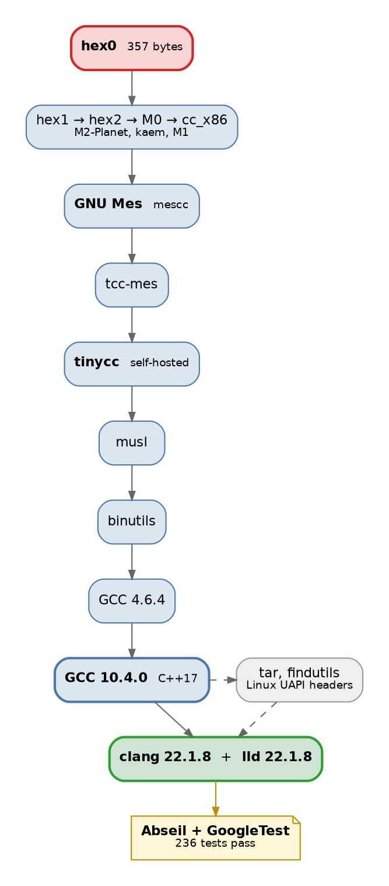

I have been fascinated and amazed by [stage0](https://savannah.nongnu.org/projects/stage0/) for a while now ever since I learnt about it via Guix [using it](https://guix.gnu.org/en/blog/2023/the-full-source-bootstrap-building-from-source-all-the-way-down/) to provide twenty two thousand packages source-bootstrapped from the 357-byte seed.

What is stage0?

It is a chain of compilers and assemblers that can be built from source, starting from **a 357-byte** program that can eventually build a recent GCC.[^gcc]

[^gcc]: Once you can reach a recent-enough GCC, you can build any C/C++ program and beyond easily.

Since then, [NixOS](https://discourse.nixos.org/t/a-full-source-bootstrap-for-nixos/74801) and [other distributions](https://github.com/fosslinux/live-bootstrap) have also adopted the same approach to minimize their binary seed which makes it possible to onboard new architectures and platforms much simpler.

What's always _frustrated_ me as a [Bazel](https://bazel.build/) (& [Buck](https://buck2.build/)) user is the reliance on prebuilt toolchains even for things that should be built from source [easily like protoc]().

Bazel has given up trying to provide a hermetic C++ toolchain and the upstream [rules_cc](https://github.com/bazelbuild/rules_cc) ruleset just points you elsewhere:

> Configuring a hermetic toolchain makes your build more deterministic. rules_cc itself does not yet offer a hermetic toolchain distribution

I had attempted to provide a stage0 hermetic C++ toolchain in [October 2024](https://github.com/fzakaria/stage0-bazel/tree/d22d6b050f66a93c1b843c24b8f17dc519dd4802) via [https://github.com/fzakaria/stage0-bazel](https://github.com/fzakaria/stage0-bazel). I made substantial process through the bootstrap process but I did not make it far enought to be usabale.

To be honest, I was also a little disheartened that no one else in the community thought it was the greatest thing since slice bread. Everyone seems to be content with using prebuilt toolchains as they go deeper into [MODULE.bzl madness]().

I had put it aside for a while, but I have been thinking about it again recently. The steps are mechanical and the process imitates existing distributions, so this became a perfect project for me to throw at an LLM to finish.[^llm]

[^llm]: Consider this the disclosure that I used an LLM to help me write the remainder of the toolchain.

You can now leverage the toolchain to build `cc_binary` in Bazel and have it compiled by a toolchain whose **entire ancestry** is in the repository from that same **357-byte seed**. 🎆

How complete is this toolchain?

I pointed the toolchain at [Abseil](https://abseil.io/) and [GoogleTest](https://github.com/google/googletest) straight from the Bazel Central Registry **without any patches**.

```python
bazel_dep(name = "stage0-bazel", version = "0.1.0")
bazel_dep(name = "abseil-cpp", version = "20260107.1")
bazel_dep(name = "googletest", version = "1.17.0.bcr.2")


register_toolchains(
    "@stage0-bazel//toolchain:clang",
    "@stage0-bazel//toolchain:cc",
)
```

We then can build and run their testsuite to provide a sanity check that the toolchain is working correctly.

```console
$ bazel test --target_pattern_file=absl-tests.txt
Executed 236 out of 236 tests: 236 tests pass
```

We use a `--target_pattern_file` to filter tests that require `google_benchmark`. Abseil marks `google_benchmark` as a `dev_dependency`, and Bzlmod drops dev dependencies of non-root modules.
{:.aside}

That is us building Abseil and GoogleTest, from the registry, unpatched, compiled by a toolchain that began as 357 bytes of hex.



{: style="--graphviz-height: 40rem"}

How can I be so sure this is a hermetic toolchain?

The toolchain includes an _audit report_ that uses Bazel's [aspects](https://bazel.build/extending/aspects) to inspect every action in the build graph and verify that it only executes programs built by the toolchain itself. The report is generated by running `bazel build //:trust-report` and will fail if any action executes a program outside of the Bazel output tree.[^1]

[^1]: We also set `BAZEL_DO_NOT_DETECT_CPP_TOOLCHAIN=1` to disable Bazel's built-in C++ host toolchain detection.

The report is two lines long:

```
Bootstrap trust report

Every action in the checked graph runs a program built by this
repository, except for these audited seed binaries:

external/+_repo_rules+hex0-seeds/POSIX/x86/hex0-seed
/nix/store/…-bash-interactive-5.3p3/bin/bash
```

Unfortunately, since `genrule` runs a shell it takes as an absolute system path that is also listed as a seed binary. `sh_toolchain`'s `path` attribute is a string, and the shell is not a declared input of the action, so no artifact this repository built can provide it.

Building toolchains from bootstrap seeds was never a priority for companies like Google where they control the entire build environment.
However we seemed to have adopted the same approach as Bazel and similar build systems have become more popular in the open-source community. We should strive to make our builds more reproducible and hermetic, and this is a step in that direction.