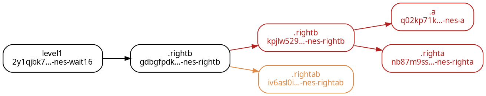
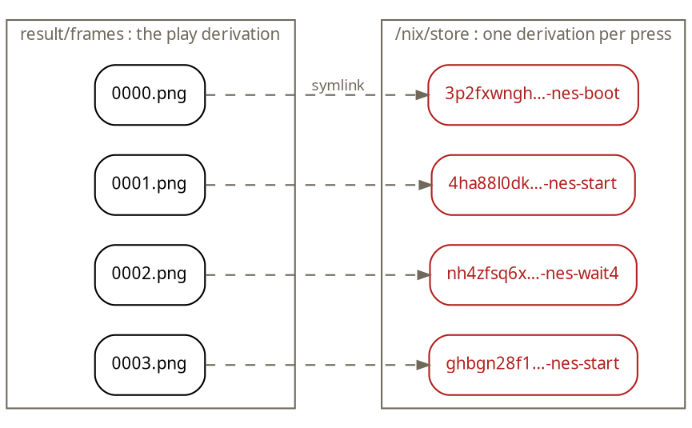

One of the most surprising aspects of the Nix language is that it is _lazy_, especially if you have never used a lazy language before. This laziness is what makes much of [Nixpkgs](https://github.com/NixOS/nixpkgs) possible, and its complexity.

One of the simplest ways to observe the laziness is by understanding that only the attributes you access are evaluated.

```console
$ nix eval --expr 'let pkgs = 
   { hello = "hi"; broken = throw "never forced"; }; 
   in pkgs.hello'
"hi"
```

The more whackier version of this is you can have _endless_ recursion in an attribute set. Nixpkgs is filled with these bottomless attribute sets:

```console
$ nix eval -f '<nixpkgs>' 'pkgs.hello' --raw
/nix/store/18bbdvag5v2f3d4y37pdbkzvh7s71cw4-hello-2.12.2

$ nix eval -f '<nixpkgs>' 'pkgs.pkgs.pkgs.hello' --raw
/nix/store/18bbdvag5v2f3d4y37pdbkzvh7s71cw4-hello-2.12.2

$ nix eval -f '<nixpkgs>' 'pkgs.python3Packages.pkgs.hello' --raw
/nix/store/18bbdvag5v2f3d4y37pdbkzvh7s71cw4-hello-2.12.2
```

The same store path every time. `pkgs` contains itself, and so does every package set inside it. 🤯


If laziness is what lets a recursive attribute set terminate, then the recursion doesn't have to bottom out **at all**:

```console
$ nix eval --expr \
    'let countdown = n: { value = n; next = countdown (n + 1); };
     in (countdown 0).next.next.next.value'
3
```

That attribute set is infinitely deep. Indexing three levels into it costs exactly three levels of evaluation, and the rest of the infinite tree is never built because nobody asked.

So an attribute path is a walk through a lazily-generated tree. Which made me wonder: what if the attribute path were _input to something_? 🤔

I decided to take that idea and make the attribute path a sequence of button presses in [Super Mario Bros. 3](https://en.wikipedia.org/wiki/Super_Mario_Bros._3). Each node in the tree is a frame of the game, and each child is a button press that produces a new frame. Game states are recursive by nature.

```console
$ nix build '.#level1.rightb.rightb.rightab.rightb'
$ file -L result
result: PNG image data, 256 x 240, 8-bit/color RGB, non-interlaced
```

`.rightb` is right + B, which in Super Mario Bros. 3 is "run right". `.rightab` is run and jump. The output is the frame you'd be looking at if you'd pressed those buttons in that order, on real hardware, in that game.[^1]

Append `.play` anywhere along the path and you get the whole run stitched into a recording:


The coolest thing though is that every one of those frames **is a separate derivation in my store**.

The code is at [fzakaria/nes-nix](https://github.com/fzakaria/nes-nix). It is generalized and the ROM is a flake input you point wherever you like for any other game.

The flake computes a derivation based on the attribute path such that each press is its own derivation, and it takes **the previous press's savestate as an input**. Each derivation _never_ re-emulates its ancestors' frames.[^image]

[^image]: A screenshot of the frame is also produced, which is used when we want to stitch a video sequence together.



The practical consequence is that the store becomes the emulator's savestate history:

```console?comments=true
# 3 derivations, cold
$ nix build '.#game.start4.wait2.right'
# 1 derivation, prefix reused
$ nix build '.#game.start4.wait2.left'
# 1 derivation, all of it reused
$ nix build '.#game.start4.wait2.right.right'
```

Branching off the middle of a hundred-press run costs one press as does appending to the end of it.

We can look at it the other way. The dependency graph _is_ the input sequence, so we can ask Nix what buttons produced a frame:

```console
$ nix-store --query --tree 
     $(nix eval --raw '.#game.start.wait4.start.drvPath')
/nix/store/32n4ni0zg01b9c9v64x67am37rdmmr9y-nes-start.drv
└───/nix/store/j5vy3385pgs9dzw0y7sdrdmn7xnrxgji-nes-wait4.drv
    └───/nix/store/w4zz5aqj5zxqhnialabdc7p3sy80v6dc-nes-start.drv
        └───/nix/store/k9wfz8w5157d0xdwaw1vvhf019dvw5s0-nes-boot.drv
```

So what is `.play` actually doing? 

Almost nothing. Every frame along the path is already sitting in the store as the output of its own press, so the recording never emulates anything. It is a directory of symlinks to the frames for `ffmpeg` to process.

```console
$ nix build '.#level1.rightb.rightb.rightab.play'
$ ls -l result/frames | head -4
0000.png -> /nix/store/3p2fxwngh…-nes-boot
0001.png -> /nix/store/4ha88l0dk…-nes-start
0002.png -> /nix/store/nh4zfsq6x…-nes-wait4
0003.png -> /nix/store/ghbgn28f1…-nes-start
```



How far can we take this input-sequence game input idea?

Nix **by default** gives out at around 2,400 presses, with:

```console
$ nix eval --raw ".#game.right.right.right…drvPath"
error: stack overflow; max-call-depth exceeded
```

`max-call-depth` defaults to 10,000 and evaluating each press costs roughly four nested calls. 

It's a guard against runaway recursion, not a structural limit, and we can raise it to 10 million and get 20,000 presses:

```console
$ ulimit -s unlimited
$ nix eval --raw --option max-call-depth 10000000 \
      ".#game.$(
        python3 -c 'print(".".join(["right"]*20000))')
      .drvPath"
/nix/store/p4nm0a4p4k9bdjqsag1jj0baah9mj6hb-nes-right.drv
```

20,000 presses, takes roughly fourteen seconds to evaluate on my laptop. The cost is linear in the number of presses, and it is roughly 0.7ms "per press".

```plotnine
import pandas as pd
from plotnine import *

# `nix eval --raw .#game.<n presses>.drvPath`, warm store, one run each.
df = pd.DataFrame({
    "presses": [100, 250, 500, 1000, 2000, 4000, 8000, 12000, 16000, 20000],
    "seconds": [0.82, 1.32, 1.45, 1.72, 2.35, 3.73, 6.73, 7.90, 9.75, 14.39],
})

plot = (
    ggplot(df, aes("presses", "seconds"))
    + geom_vline(xintercept=2400, linetype="dotted", color=INK, alpha=0.7)
    + geom_vline(xintercept=21845, linetype="dashed", color="#e08a45")
    + annotate("text", x=3000, y=13.2, label="default max-call-depth\nstops you here (~2,400)",
               ha="left", size=7, color=INK)
    + annotate("text", x=21000, y=5.5, label="kernel argv limit\n21,845 presses",
               ha="right", size=7, color="#e08a45")
    + geom_line(color="#b1201d", size=0.9)
    + geom_point(color="#b1201d", size=1.9)
    + labs(x="presses in the attribute path", y="nix eval (seconds)")
    + scale_x_continuous(labels=lambda xs: [f"{int(x):,}" for x in xs])
)
plot.width, plot.height = 7.0, 3.4
```
{: title="nix eval time against attribute path length: roughly linear from under a second at 100 presses to about 14 seconds at 20,000, with the default max-call-depth wall at 2,400 and the kernel argv limit at 21,845"}


The next bottleneck though is that the kernel gives out at 21,845 presses on my machine. An attribute path is a single `argv` element, and Linux caps the size of the argument list in total and individual arguments.

The per-argument limit is 131,072 bytes (`MAX_ARG_STRLEN`), and each press is six bytes long (`right.`), so 21,845 presses is the maximum that can be passed to `nix eval` as a single argument.

The escape hatch is to stop passing the run as an argument. and we can feed in the input-sequence as from a file:

```console
$ nix build --impure --expr \
    '(builtins.getFlake (toString ./.))
      .packages.x86_64-linux.game.sequenceFile 
        ./runs/world1-1.txt'
```

This produces a derivation bit-identical to the one built from the attribute path, so a run kept in a file still shares the same store paths.


All of this was to simply _evaluate_ the Nix expression. Now we have to build it. Although Nix is great at building derivations in parallel, the recursion here is tail-recursive and therefore serial.

I benchmarked the build time of a growing list of button presses and the cost is also linear, as we would expect, with the number of presses. The cost per press is roughly 1.27 seconds with substituters enabled and 0.28 seconds with them disabled. The round-trips cost for checking whether the derivation is in the cache costs noticeably more than emulating the frames does.[^local]

[^local]: We can set `preferLocalBuild` or `allowSubstitutes` if we want to avoid this cost.

```plotnine
import pandas as pd
from plotnine import *

# Each row is a cold chain: forked onto its own branch first, so every press
# genuinely emulates rather than hitting the store.
df = pd.DataFrame({
    "presses": [25, 50, 100, 200] * 2,
    "seconds": [55.22, 72.06, 157.42, 278.06,
                8.96, 15.29, 29.87, 58.71],
    "mode": ["default (queries binary caches)"] * 4 + ["--option substitute false"] * 4,
})
df["per_press"] = df.seconds / df.presses

tall = df.melt(id_vars=["presses", "mode"], value_vars=["seconds", "per_press"])
panels = ["total wall clock (s)", "seconds per press"]
tall["panel"] = pd.Categorical(
    tall.variable.map(dict(zip(["seconds", "per_press"], panels))),
    categories=panels, ordered=True,
)

plot = (
    ggplot(tall, aes("presses", "value", color="mode", shape="mode"))
    + geom_line(size=0.9)
    + geom_point(size=2.0)
    + facet_wrap("panel", scales="free_y")
    + scale_color_manual(values=["#1a7f37", "#b1201d"])
    + expand_limits(y=0)
    + labs(x="presses built", y="", color="", shape="")
    + theme(legend_position="bottom", legend_box_margin=0, subplots_adjust={"wspace": 0.3})
)
plot.width, plot.height = 7.4, 3.6
```
{: title="Build time against number of presses. Total wall clock is linear in both configurations, 1.27 seconds per press with substituters enabled and 0.28 with them disabled; cost per press is flat in both cases with a constant gap of roughly 4.5x"}

We're used to the attribute path being a _name_, simply a coordinate into a catalogue of things that exist. Laziness means it's really a _program_: a sequence of steps the evaluator walks, generating whatever it needs as it goes.

Nixpkgs happens to use that machinery to describe software, but nothing about it requires that the tree be a catalogue at all. Coupled with the fact that the store turns out to be a decent persistence layer for reproducible state-machines, makes a our "package manager" reasonable to use for playing Mario. 🍄

[^1]: The prefix `.#level1` is a precanned sequence of button presses that gets you to the start of level 1-1.
