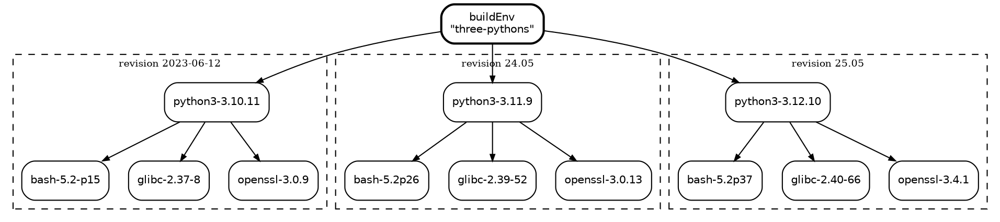

_Enter the Nixpkgs multiverse. All the versions that ever existed, all in one place._

I bumped the `nixpkgs` release for my NixOS configuration to refresh many of my packages and found that a package I depended on at a particular version is no longer available.

The package was "version bumped forward" in a way that broke some of my tooling. It's late and I don't want to fix it, so I just add another `nixpkgs` input pinned to the commit that had the version I want. This works, but it is miserable in a way that compounds.

```nix
{
  inputs = {
    nixpkgs-unstable.url = "github:NixOS/nixpkgs/nixos-unstable";
    nixpkgs-25_11.url = "github:NixOS/nixpkgs/nixos-25.11";
    nixpkgs-25_05.url = "github:NixOS/nixpkgs/nixos-25.05";
  };
}
```

The need for the most recent package is so common that I had keep an overlay that would inject `unstable` as a package set for me to easily pull from.

```nix
unstable-packages = final: _prev: {
  unstable = import inputs.nixpkgs-unstable {
    system = final.stdenv.hostPlatform.system;
    config.allowUnfree = true;
    overlays = [inputs.nix-vscode-extensions.overlays.default];
  };
};
```

If I have a need for a particular version of a package and it's not present in my current `nixpkgs`, I am left searching for the commit and pinning it.[^pin]

[^pin]: Thankfully sites like [nixhub.io](https://www.nixhub.io/) or [lazamar's search](https://lazamar.co.uk/nix-versions/) make this a little easier.

Every pin is a whole extra `nixpkgs` in the file. Flake inputs are fetched **eagerly** even if not used. A flake with three `nixpkgs` inputs whose output references only the _first_ are all materialised.

Nix lets us easily create a closure that reproduces a specific version of a package, but Nixpkgs makes it hard to hold one package still while everything else moves.

Each Nixpkgs input to a flake is a distinct universe. If we can have multiple Nixpkgs as input to achieve fetching a particular package, why not **have every version that ever existed always available**? 🤯

## nixpkgs-multiverse

[nixpkgs-multiverse](https://github.com/fzakaria/nixpkgs-multiverse) is one
flake input that gives you **all of them** at once.

```console?comments=true
$ nix run 'github:fzakaria/nixpkgs-multiverse#versions.python3."3.6.2"' -- --version
Python 3.6.2

$ nix run 'github:fzakaria/nixpkgs-multiverse#versions.python3."3.8.9"' -- --version
Python 3.8.9

# We can also get the latest version of a package.
$ nix run 'github:fzakaria/nixpkgs-multiverse#latest.python3' -- --version
Python 3.14.6
```

We can query the flake for all the versions of a package that **ever existed in Nixpkgs**.

```console?comments=true
$ nix eval --json --apply 'f: f "python3"' \
   github:fzakaria/nixpkgs-multiverse#multiverse.x86_64-linux.versionsOf
[
  "3.5.3",
  "3.6.2",
  # 53 other versions omitted for brevity
  # ... 
  "3.13.13",
  "3.14.6"
]
```

If we want a specific complete revision of Nixpkgs we can use the `at` function.

```nix
let
  mv = multiverse.multiverse.x86_64-linux;
  # newest revision the index knows, as a real Nixpkgs
  pkgs_tip = mv.tip;
  # by release
  pkgs_24_11 = mv.at "24.11";
  # newest revision on or before that date
  pkgs_2022_03_15 = mv.at "2022-03-15";
  # by commit
  pkgs_aae12a743f75 = mv.at "aae12a743f75";
in {
  packages = [
      pkgs_tip.python3
      pkgs_24_11.python3
      pkgs_2022_03_15.python3
      pkgs_aae12a743f75.python3
    ];
}
```

That is access to all the versions of all the packages that ever existed in Nixpkgs. You can mix them all together in one shell, one package or a build environment.


How is it possible to have multiple Python versions? That is the whole point of Nix itself. Every package immaculately describes its dependencies using a hash via the [intensional model]().[^intensional]

[^intensional]: The hash is a unique identifier for the exact set of inputs that were used to build it. If you change any input, the hash changes and you get a new package.




Nixpkgs already supports multiple versions of a package in a single revision (i.e. `python39`, `python312`, `gcc12`) as separate attributes. We took this to its logical conclusion of making them all available easily.

## What's the magic?

Our `flake.nix` deliberately has no inputs: `inputs = { }`. Inputs are fetched eagerly, and we have 1,393 of them. We need to fetch them lazily, only when something actually references a revision. To do this, we fetch revisions with `builtins.fetchTree`, pinned by `narHash`, only when needed.

Two files do all the work: `revisions.json` and `versions.json`.

`revisions.json` is one ordered array of every revision from [Nixpkgs](https://github.com/NixOS/nixpkgs), 1,393 as of this writing, from 2017 to 2026.[^revisions]

[^revisions]: A NixOS release is not special; it is a commit that happens to carry a `release` label.

```json
[
  {
    "rev": "0eeebd64de89…",
    "date": "2023-06-12",
    "channel": "nixos-unstable",
    "narHash": "sha256-2xT+Jmk3m…"
  },
  {
    "rev": "afb2b21ba489…",
    "date": "2025-05-23",
    "channel": "release",
    "release": "25.05",
    "narHash": "sha256-rWtXrcIzU5wm…"
  }
]
```

We limit our commits to those that were actually built and cached by Hydra, so we only include commits that were either a release or a `nixos-unstable` channel bump.

How do we know which revisions to pick for the `nixos-unstable` ones?

We rely on the [nix-releases S3 bucket](https://nix-releases.s3.amazonaws.com/) to tell us which commits actually became published builds. The S3 bucket uses the commit hash as the directory name, so we can list the bucket and get a complete list of all revisions that were actually built.

`index/versions.json` is the map from (attribute, version) to a revision:

```json
{
  "revisionCount": 1393,
  "attrs": {
    "python3": { "3.8.9": 412, "3.12.10": 1204 }
  }
}
```

That integer is an offset into `revisions.json`. It is the most recent revision that shipped that version.

## Sparse data

At this many revisions, it turns out that how you encode the data matters a lot.
My first encoding stored every revision a version appeared in.

Although it was simple, it was a disaster in terms of size for these JSON files.
As you might expect, most versions of most packages are unchanged across many revisions.
The size of our `versions.json` file was growing linearly with the number of revisions.

By storing only the _newest_ revision that shipped a version, we can keep the file small and still answer the question "which revision had this version". Here is how it actually grows as revisions get indexed:

```plotnine
import pandas as pd
from plotnine import *

# Measured while indexing all 1,393 revisions oldest-first, newest-only encoding.
df = pd.DataFrame({
    "revisions": [100, 200, 300, 400, 500, 600, 700, 800, 900, 1000, 1100,
                  1200, 1300, 1393],
    "megabytes": [0.50, 0.67, 0.84, 1.14, 1.37, 1.63, 1.86, 2.06, 2.32, 2.64,
                  3.17, 3.75, 4.41, 5.18],
})

plot = (
    ggplot(df, aes("revisions", "megabytes"))
    + geom_area(fill="#4c72b0", alpha=0.2)
    + geom_line(color="#4c72b0", size=0.9)
    + geom_point(color="#4c72b0", size=1.6)
    + labs(x="revisions indexed", y="index/versions.json (MB)")
    + scale_x_continuous(labels=lambda xs: [f"{int(x):,}" for x in xs])
)
plot.width, plot.height = 7.0, 3.2
```

5.18 MB covering **1,393 revisions** and 289,521 distinct (attribute, version)
pairs.


## Performance

The key design rule for our flake:

> Cost is per **revision touched**, not per package.

If we were to add revisions as inputs, evaluating our flake would explode. Each flake in our measurement below has N `nixpkgs` inputs and an output that references **only the first one**; the timing is how long before that output evaluates.[^perf]

[^perf]: Everything is `git+file` against a local clone, so there is no network latency.

```plotnine
import pandas as pd
from plotnine import *

# Each N uses a different set of revisions so nothing is warm from the last run.
eager = pd.DataFrame({
    "pins": [1, 2, 3, 4, 5],
    "seconds": [6.2, 12.3, 18.8, 23.2, 26.2],
    "approach": "flake inputs (eager)",
})
# The multiverse knows about 1,393 revisions; touching none costs one JSON parse.
lazy = pd.DataFrame({
    "pins": [1, 2, 3, 4, 5],
    "seconds": [0.20, 0.20, 0.20, 0.20, 0.20],
    "approach": "multiverse (lazy)",
})
df = pd.concat([eager, lazy])

plot = (
    ggplot(df, aes("pins", "seconds", color="approach"))
    + geom_line(size=0.9)
    + geom_point(size=1.9)
    + scale_color_manual(values={"flake inputs (eager)": "#b1201d",
                                 "multiverse (lazy)": "#55a868"})
    + labs(x="nixpkgs revisions you have pinned",
           y="seconds before your output evaluates")
)
plot.width, plot.height = 7.0, 3.4
```

Five `nixpkgs` pins that are not used cost **26 seconds** before the output evaluates.
Each input costs about 5 seconds, and the input is fetched and materialised even if never used. In contrast, the green line is `nixpkgs-multiverse` with **1,393 revisions available**, which is a flat 0.20s to parse the JSON. 🤩

Revisions are memoised, so pulling 3 packages out of one revision costs the
same as pulling one.

```plotnine
import pandas as pd
from plotnine import *

df = pd.DataFrame({
    "what": ["index only\n(0 revisions)", "1 revision", "3 revisions",
             "5 revisions", "3 packages,\nsame revision"],
    "seconds": [0.30, 0.37, 0.62, 1.66, 0.29],
    "kind": ["index", "fetch", "fetch", "fetch", "memoised"],
})
df["what"] = pd.Categorical(df["what"], categories=df["what"], ordered=True)

plot = (
    ggplot(df, aes("what", "seconds", fill="kind"))
    + geom_col(width=0.6)
    + scale_fill_manual(values={"index": "#8c8c8c", "fetch": "#4c72b0",
                                "memoised": "#55a868"})
    + labs(x="", y="cpu seconds")
)
plot.width, plot.height = 7.0, 3.4
```

## Why I like this

That concept that the `/nix/store` can hold many graphs of the same package is core to understanding Nix. The popularity and rise of flakes made it even more apparent that we can mix multiple revisions of Nixpkgs together.

The thing I keep coming back to is that Nixpkgs history _already is_ the
multiverse. Every version that ever existed is already built, already cached,
already reachable. It was just addressed by commit hash instead of by version
number, which is exactly backwards from how anyone thinks about it.

The whole project is 5 MB of JSON and about 200 lines of Nix. It does not
build anything, mirror anything, or host anything. It is a phone book.

```nix
inputs.multiverse.url = "github:fzakaria/nixpkgs-multiverse";
```

```plotnine
import itertools
import pandas as pd
from plotnine import *

# Every revision from the first nixos-unstable bump onward, delta-encoded in
# days from it (2017-11-29) so the whole set fits in the fence that draws it.
# The releases older than that are left out; the only python3 versions this
# drops are 3.5.3 in 17.03 and 3.6.2 in 17.09.
GAPS = (
    "0 1 0 1 1 1 1 9 6 7 6 7 1 1 7 3 1 1 1 5 2 0 1 8 4 1 3 1 2 3 8 1 1 1 "
    "19 0 11 3 1 2 18 0 2 5 3 10 0 1 0 1 1 1 2 1 17 11 6 2 0 1 5 2 0 2 20 "
    "2 10 0 1 0 1 4 7 2 2 8 0 8 1 1 3 3 0 6 0 4 2 1 1 7 4 8 11 3 10 16 3 "
    "1 0 1 2 1 1 0 1 0 0 1 13 3 4 10 0 2 4 1 9 6 1 2 1 0 1 0 1 1 6 2 1 1 "
    "1 3 1 3 1 1 3 10 2 0 1 3 12 1 4 4 5 7 1 4 3 2 1 1 1 2 1 5 2 1 0 0 1 "
    "0 3 3 1 2 2 1 0 1 1 4 1 2 4 0 2 3 0 5 8 0 4 1 1 4 1 10 0 1 1 4 0 0 3 "
    "1 2 0 1 1 1 0 2 0 1 0 1 0 0 2 0 7 2 1 0 1 0 2 0 0 4 3 1 7 10 1 0 1 2 "
    "2 13 1 0 1 1 1 1 7 3 8 3 12 3 1 7 1 2 2 0 4 11 1 1 3 1 1 1 2 8 2 1 1 "
    "2 1 2 1 3 0 1 1 1 2 1 1 1 1 1 1 3 1 9 10 2 1 2 1 1 1 1 1 1 2 1 1 0 8 "
    "3 2 1 7 1 10 0 4 2 1 3 4 0 1 4 2 13 3 0 2 2 2 8 2 4 4 8 1 2 1 2 2 8 "
    "1 2 1 6 1 7 1 7 4 2 4 3 1 1 6 1 2 1 18 0 4 4 3 1 3 2 2 11 4 5 2 2 0 "
    "1 6 0 6 5 2 3 0 3 3 1 2 3 4 1 1 3 4 2 14 2 1 1 2 4 2 1 2 2 6 2 4 4 6 "
    "1 1 1 2 3 1 1 3 3 1 2 3 2 4 4 2 3 3 3 1 3 4 3 4 6 2 1 2 2 1 2 2 1 1 "
    "2 1 2 0 2 6 1 1 1 2 0 4 1 1 1 1 1 1 3 1 2 1 3 1 1 2 1 3 2 4 3 5 3 1 "
    "1 2 4 2 1 1 0 3 0 2 2 1 1 2 1 1 0 1 1 3 3 3 5 2 1 2 0 2 2 1 1 1 2 1 "
    "1 1 4 1 2 2 2 1 3 2 1 1 1 1 1 1 1 1 2 1 1 2 4 1 3 2 3 2 1 2 1 1 1 2 "
    "3 3 1 3 6 1 3 1 1 4 3 2 2 2 2 5 2 1 3 1 0 1 1 2 4 1 3 1 1 1 2 2 2 1 "
    "0 2 1 1 1 4 1 3 4 2 1 3 2 5 2 1 1 1 3 2 3 1 1 3 0 1 1 1 2 8 1 8 1 3 "
    "5 2 2 6 1 2 4 3 4 3 2 1 2 1 0 3 1 1 6 1 1 2 6 2 4 1 1 1 2 0 1 2 1 2 "
    "4 1 1 3 1 0 1 3 4 1 3 1 1 1 1 1 2 1 2 1 1 2 1 1 2 3 1 1 1 1 2 1 1 1 "
    "1 2 3 0 1 1 1 2 1 1 1 1 1 1 1 0 1 1 3 0 2 1 1 1 1 1 2 1 1 1 1 2 1 1 "
    "1 2 1 0 1 1 1 1 3 1 8 1 1 1 1 1 1 1 2 3 1 2 1 1 1 1 2 2 1 1 1 1 1 1 "
    "1 2 1 1 1 1 1 2 1 1 1 1 1 1 1 1 1 1 1 1 1 2 1 2 0 2 1 1 1 3 1 1 1 1 "
    "1 2 1 0 1 1 1 1 2 3 0 2 1 1 1 1 1 1 1 2 1 1 1 1 1 1 1 4 3 1 2 1 2 2 "
    "1 2 3 0 2 1 1 1 2 4 1 3 2 5 1 1 1 1 1 2 1 2 2 1 1 1 1 1 1 1 2 1 1 3 "
    "1 2 1 3 2 1 1 1 1 1 1 2 1 2 1 1 2 3 0 2 0 1 2 2 1 2 2 1 2 1 1 1 1 2 "
    "1 1 1 1 1 3 1 1 1 1 2 1 1 2 2 1 1 8 1 1 1 0 2 0 1 1 1 1 1 3 1 1 2 0 "
    "1 3 0 1 2 1 1 1 1 1 2 2 1 5 1 2 1 1 2 1 1 1 2 1 1 3 1 1 1 2 1 0 1 2 "
    "2 1 1 2 1 1 2 1 2 1 1 3 1 1 1 1 1 3 1 1 1 1 1 1 2 1 2 2 1 0 1 2 1 1 "
    "1 2 2 2 3 3 1 2 2 3 3 2 2 2 3 2 3 2 5 3 5 2 3 4 2 8 2 3 2 2 2 3 3 0 "
    "3 2 5 2 6 2 3 2 3 3 3 4 2 5 2 2 2 2 4 2 2 2 2 3 2 2 2 2 1 2 2 2 2 2 "
    "2 2 1 3 3 3 3 2 3 1 3 2 2 2 2 5 0 3 2 3 2 3 0 3 2 3 1 2 5 1 2 2 2 2 "
    "1 3 2 3 1 0 3 3 2 2 1 2 2 2 3 2 2 2 2 2 2 2 3 3 1 2 5 1 3 2 2 3 2 2 "
    "2 2 1 3 2 3 2 2 2 3 4 3 3 4 3 4 2 4 1 2 3 2 1 2 2 3 3 2 3 2 3 5 2 2 "
    "2 3 2 4 4 3 4 2 3 1 4 6 3 1 1 3 2 2 2 2 2 4 3 7 2 4 2 4 2 2 1 1 2 5 "
    "2 1 2 1 2 3 2 1 2 1 1 2 3 2 1 2 3 3 2 1 2 2 2 1 1 2 4 1 1 3 1 3 3 2 "
    "3 1 2 3 1 2 1 3 6 3 2 1 4 1 2 1 1 1 1 2 0 3 3 2 3 2 3 0 2 2 2 2 3 2 "
    "2 6 4 2 2 3 0 3 3 4 2 2 6 2 3 4 2 1 2 3 2 1 3 3 3 2 5 6 1 2 2 3 3 3 "
    "2 3 3 2 1 2 3 4 4 4 1 2 3 3 4 3 3 3 3 2 3 3 3 1 4 1 3 2 2 3 3 0 2 3 "
    "3 3 4 3 3 4 3 2 3 3 2 1 3 2 3 4 1 2 3 4 3 1 1 0 4 3 2 4 6 4 3 1 1 2 "
    "2 2 2 1 1 1 1 1 1 3 3 4 4 4 4 5 4 4 5 3 5 5 5 6 2 0 7 1 6 4 6 10 3 3 "
    "3 3 3 3 1 3 1 "
)

# Every python3 version in the index, at the newest revision that shipped it:
# the revision `versions.python3."<v>"` resolves to.
PYTHONS = (
    "2017-12-19:3.6.3 2018-04-10:3.6.4 2018-07-10:3.6.5 2018-11-17:3.6.6 "
    "2018-12-14:3.7.1 2019-04-04:3.7.2 2019-07-12:3.7.3 2019-10-20:3.7.4 "
    "2019-12-26:3.7.5 2020-04-20:3.7.6 2020-06-14:3.7.7 2020-08-01:3.8.3 "
    "2020-10-27:3.8.5 2021-01-17:3.8.6 2021-02-24:3.8.7 2021-04-24:3.8.8 "
    "2021-07-18:3.8.9 2021-07-27:3.9.5 2021-12-25:3.9.6 2022-02-09:3.9.9 "
    "2022-04-03:3.9.10 2022-04-17:3.9.11 2022-05-31:3.9.12 "
    "2022-06-18:3.9.13 2022-06-26:3.10.4 2022-08-15:3.10.5 "
    "2022-09-28:3.10.6 2022-10-31:3.10.7 2022-12-16:3.10.8 "
    "2023-02-25:3.10.9 2023-04-25:3.10.10 2023-06-17:3.10.11 "
    "2023-10-19:3.10.12 2023-11-14:3.11.5 2024-01-08:3.11.6 "
    "2024-02-22:3.11.7 2024-04-16:3.11.8 2024-07-03:3.11.9 "
    "2024-08-28:3.12.4 2024-10-09:3.12.5 2024-10-29:3.12.6 "
    "2024-12-20:3.12.7 2025-02-18:3.12.8 2025-05-04:3.12.9 "
    "2025-06-17:3.12.10 2025-07-08:3.13.4 2025-08-19:3.13.5 "
    "2025-09-08:3.13.6 2025-10-19:3.13.7 2025-11-11:3.13.8 "
    "2025-12-28:3.13.9 2026-02-17:3.13.11 2026-05-15:3.13.12 "
    "2026-07-05:3.13.13 2026-07-19:3.14.6 "
)

REVS = "1,391 revisions"
PYS = "55 python3 versions"

dates = pd.to_datetime("2017-11-29") + pd.to_timedelta(
    list(itertools.accumulate(int(g) for g in GAPS.split())), unit="D"
)

pythons = pd.DataFrame(
    [p.split(":") for p in PYTHONS.split()], columns=["date", "version"]
)
pythons["date"] = pd.to_datetime(pythons["date"])
pythons = pythons.sort_values("date").reset_index(drop=True)
pythons["minor"] = pythons["version"].str.rsplit(".", n=1).str[0]

# Every tick the same height: the height is not carrying data, and staggering
# it to make room for 55 labels only turns the chart into a staircase. The
# patch releases are the marks; the series is what gets named.
TICK = 0.55
pythons["y0"], pythons["y1"], pythons["kind"] = 0.0, TICK, PYS

# One label per series, at the oldest version in it. Series starts are months
# apart, so these never crowd each other.
series = pythons.groupby("minor", as_index=False).first()

# The ribbon of every revision, centred inside the ticks it is being read
# against.
revisions = pd.DataFrame(
    {"date": dates, "y0": TICK * 0.3, "y1": TICK * 0.7, "kind": REVS}
)

plot = (
    ggplot(mapping=aes(x="date", xend="date", y="y0", yend="y1", color="kind"))
    + geom_segment(pythons, size=0.9)
    + geom_segment(revisions, size=0.3, alpha=0.45)
    + geom_text(series, aes(x="date", y=TICK + 0.06, label="minor"), size=8,
                color="#55a868", ha="left", va="bottom", inherit_aes=False)
    + scale_color_manual(values={REVS: "#4c72b0", PYS: "#55a868"},
                         breaks=[PYS, REVS], name="")
    + scale_y_continuous(limits=(0, TICK + 0.28), expand=(0, 0))
    + guides(color=guide_legend(override_aes={"size": 1.4, "alpha": 1}))
    + labs(x="", y="")
    + theme(axis_text_y=element_blank(), axis_ticks_major_y=element_blank(),
            panel_grid_major_y=element_blank(),
            panel_grid_minor_y=element_blank(),
            legend_position="bottom", legend_direction="horizontal",
            legend_title=element_blank())
)
plot.width, plot.height = 7.0, 2.8
```
