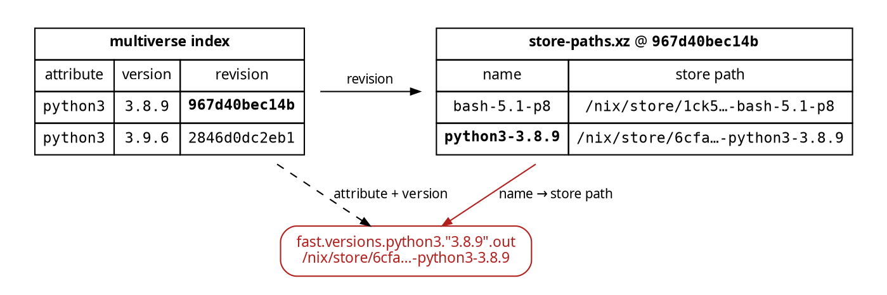

> _"The fastest evaluation is the one that never happens."_
> 
> -- Sun Tzu, *The Art of Evaluation*

[nixpkgs-multiverse]() gives you every version of every package that ever shipped in Nixpkgs from a single flake input.

> **Note**
> It continues to blow my mind that this is even possible. It feels like it suddenly
> unlocks a new dimension of Nixpkgs, and I am still trying to understand what it means.
> I think this capability is a fundamental change to the way we think about Nixpkgs, and it is not just a new feature. It is a new way of thinking about the entire ecosystem.
{: .alert .alert-info}

There was always a penalty at the center of it. Asking for a specific version of `python3`, such as `3.8.9`, meant fetching the whole ~378 MB Nixpkgs tree from 2021 and evaluating it to determine the `outPath`. 

What if we could skip that evaluation? What if we could just ask for the path directly, and have Nix fetch it from the cache if it is there?

This is a common idiom if you have ever used `nix-store`.

```console?comments=true
# check if the store has the path already
$ nix path-info --store https://cache.nixos.org/ \
      /nix/store/6cfajs6lsy9b4wxp3jvyyl1g5x2pjmpr-python3-3.8.9
/nix/store/6cfajs6lsy9b4wxp3jvyyl1g5x2pjmpr-python3-3.8.9

# fetch it if it does
$ nix-store --realise /nix/store/6cfajs6lsy9b4wxp3jvyyl1g5x2pjmpr-python3-3.8.9
/nix/store/6cfajs6lsy9b4wxp3jvyyl1g5x2pjmpr-python3-3.8.9
```

That requires knowing the store path upfront.

[nixpkgs-multiverse](https://github.com/fzakaria/nixpkgs-multiverse) now has a `fast` attribute that does exactly that: it gives you the store path for every indexed version of every package. This lets you skip the download and evaluation of Nixpkgs and get the store path straight from the cache.


```console?comments=true
$ nix build 'github:fzakaria/nixpkgs-multiverse#fast.versions.python3."3.8.9".out' \
      --print-out-paths
/nix/store/6cfajs6lsy9b4wxp3jvyyl1g5x2pjmpr-python3-3.8.9

$ nix shell 'github:fzakaria/nixpkgs-multiverse#fast.versions.python3."3.8.9".out'
$ python3 --version
Python 3.8.9
```

No Nixpkgs is fetched. Nothing is evaluated. No experimental features and no `--impure` needed for this to work.

The complete Nix API, except for releases, works with this fast path.

```nix
# a specific version, zero-eval
mv.fast.version "python3" "3.8.9"
# newest indexed version, as of the pin
mv.fast.latest.python3
# what was current when the pin was cut
mv.fast.tip.hello
# a whole revision, as fakes
mv.fast.at "2022-03-15"
# exact revision keys work too
mv.fast."967d40bec14b".python3
```

If you want to learn more [read the docs](https://nixmultiverse.com/docs/nix-api#the-fast-path) about the feature.

## The trick: `mkFakeDerivation`

Every `nixos-unstable` channel bump published a listing of every path Hydra built for it: `store-paths.xz`, or a `MANIFEST` for back in the pre-2017 era. These files are still available, and they are the source of the multiverse index.

The listing is a map from derivation name to store path. The multiverse index is a map from `(attribute, version)` to the revision that shipped it. By joining the two, every historical version gets a concrete address:



Knowing the path is not enough, especially in the Nix language. We need to convince Nix that a string that looks like a store path actually _is_ a store path. `builtins.storePath` exists but it is an impure function and requires `--impure` to work.

How do we get around this?

We attach "context" to the String. Context is the invisible baggage a String carries in Nix. When you interpolate a derivation into a String, the result remembers where it came from, and that is what makes `nix build` realise the dependency instead of writing a dangling path into a script.

`builtins.appendContext` lets you attach it by hand.

```nix
storePath = p: builtins.appendContext p { ${p} = { path = true; }; };
```

The `path = true` identifies that "this String names a store path that must exist," which is exactly what `builtins.storePath` produces for a path already in your store, except this works for a path that is not in your store yet and is not in this evaluation's input closure either. Loopole! 👿

We then wrap that in an attrset that resembles like a derivation and the Nix CLI is satisfied:

```nix
{
  type = "derivation";
  name = "python3-3.8.9";
  pname = "python3";
  version = "3.8.9";
  system = "x86_64-linux";
  outputs = [ "out" ];
  out = storePath "/nix/store/6cfajs6lsy9b4wxp3jvyyl1g5x2pjmpr-python3-3.8.9";
}
```

This is [tomberek](https://github.com/tomberek)'s `mkFakeDerivation` trick from [fastpkgs](https://github.com/tomberek/fastpkgs), and it is an amazing trick to circumvent needing `--impure`.

Everything about this remains pure evaluation, and the resulting graph is gauranteed to
be bit-for-bit identical to what Nixpkgs would have produced if it had been evaluated. The only difference is that we skip the evaluation of Nixpkgs itself, and instead use the store path directly.

The eval path _derives_ the address, the fast path _remembers_ it.

## Footguns

A "fake" (`mkFakeDerivation`) derivation has no `drvPath`, because there is no `.drv` behind it. Nothing can build it and it can only be substituted. The `nix` CLI often wants a `drvPath` though when you hand it a derivation attrset, so we must make sure to append the output (i.e. `.out`):

```console
$ nix build 'github:fzakaria/nixpkgs-multiverse#fast.latest.hello.out'
$ nix build 'github:fzakaria/nixpkgs-multiverse#fast.latest.ffmpeg.lib'
```

`override` and `nix develop` need a real derivation. Every fake derivation carries a lazy `.eval` that is the real, revision-exact derivation:

```nix
(mv.fast.version "python3" "3.8.9").eval.override { ... }
```

In the spirit of trying to keep my index small, `meta` is empty, so there is
not additional information about the package. You can still get the `meta` from the real derivation by using `.eval` as well.

This scheme rests on [cache.nixos.org](https://cache.nixos.org) still serving thirteen-year-old paths, which thankfully it does and with the same signing key.

To demonstrate that the cache is offering nearly every path that Nixpkgs ever built, I ran a census of every indexed version of every package and asked the cache if it was still alive.

As of August 14 2026, **all 271,187 of them are alive**.  All of them, down to every NAR payload file. That is 14.8 TB of unpacked software from 2013 onward, one _fast_ command away.[^gc]

[^gc]: The NixOS infrastructure has never garbage collected the binary cache. It is an S3 bucket that only grows, and the bill is paid by the [NixOS Foundation](https://nixos.org/community/) and its sponsors.

There's some other data on [nixmultiverse.com](https://nixmultiverse.com/) about the census, dependency graphs and additional features. Check it out!

<video autoplay loop muted playsinline width="800" height="470">
  <source src="/assets/images/multiverse-universe-slider.mp4" type="video/mp4">
  <a href="/assets/images/multiverse-universe-slider.mp4">Screencast of the nixmultiverse.com universe slider</a>
</video>

All of this is also available via the [mvs](https://nixmultiverse.com/docs/cli) command line tool as well for offline use.

```console?comments=true
# how big is it, unpacked, downloaded, and in full closure
$ mvs size python3@3.8.9
python3 3.8.9 · /nix/store/6cfajs6lsy9b4wxp3jvyyl1g5x2pjmpr-python3-3.8.9
  nar (unpacked)  50.1 MiB
  download        10.6 MiB
  closure         93.8 MiB · 16 paths
  cache           live

# who links against it
$ mvs rdeps pcre2
pcre2 10.47 · referenced by 255 indexed packages

# what is this path in my store, actually
$ mvs identify /nix/store/8qi947kixhz1nw83dkwxm6d0wndprqkj-hello-2.12.2
  package  hello 2.12.2

# run takes the fast path by default
$ mvs run hello@2.12.2
Hello, world!
```

I guess now there is a caveat: there is now a trick in the multiverse. It remains mostly an index, some JSON, and a `fetchTree` behind a memo table. The clever trick is [tomberek](https://github.com/tomberek)'s, and it is three _important_ lines.