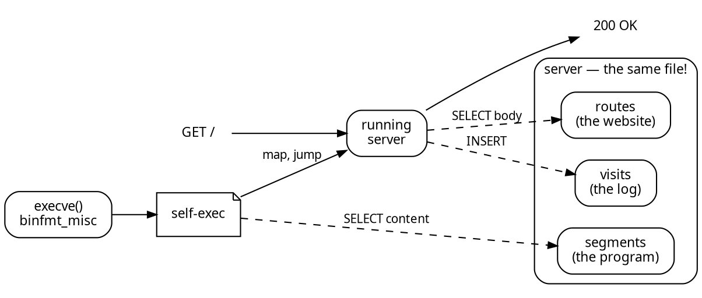

I was pleasantly surprised and happy to see that my article '[Your executable is a SQLite database]()' resonated with people. It is a format I have been thinking about for a while, and the idea seems to have
struck a chord with others.

A quick recap: **SELF**, a format where the program is a SQLite database. We can use [binfmt_misc](https://docs.kernel.org/admin-guide/binfmt-misc.html) to trigger a custom
interpreter that maps the rows in the `segments` table and jumps to the entry point,
and a whole class of binary tooling collapses into SQL.

What keeps surprising me is how having the file format be a SQLite database keeps collapsing everything into SQL. One idea that was immediately evident to myself and others through comments: If the executable is a database, and a database is something you can write to, can the _running program_ use it to also store its state? 🤔

Yes! 🤯
We can collapse not only a complete distribution but all the state for every application into a single file, alleviating the need for `/var/` or `/tmp/` or `/home/` or any other filesystem. The program can store its own state in the same file it is running from, and it can do so transactionally.

**[self-httpd](https://github.com/fzakaria/selfdb/tree/main/examples/server)** is a proof-of-concept webserver that does exactly that. It is a single file program executed from a database. The file contains the program, the website, the routes and all the visitor logs. All state is updated **in the same SQLite** file as the program itself.

```console?comments=true
# Our server is a single file, and it is a SQLite database
$ file server
server: SQLite 3.x database, application id 1397050438, ...

$ ./server --journal wal 8080
self-httpd: serving 3 routes out of /srv/self/server
self-httpd: listening on http://0.0.0.0:8080 with 4 workers

$ curl -s localhost:8080 | head -1
<!doctype html>

# nobody has pressed the button on that page yet
$ sqlite3 server 'SELECT count(*) FROM presses'
0

$ curl -s -X POST -d press localhost:8080/api/press
{"presses":1,"button":"press"}

# the application data is inside the same database
$ sqlite3 server 'SELECT id, at, button FROM presses'
1|2026-08-25 03:11:28|press

# so was the GET that fetched the page in the first place
$ sqlite3 server 'SELECT count(*) AS n, path
                  FROM visits GROUP BY path'
1|/
1|/api/press
```

This web-server is live at **<https://selfdb.exe.xyz>**.[^exe] It is one file, a SQLite database, and it is also the server. It is the website, it is the program, and it is the visitor log and state.

[^exe]: If the site is not working for you, sorry. I deployed it on their smallest tier.
        I included a screenshot of the site just in case for posterity!

![Screenshot of selfdb.exe.xyz. The heading reads "This page is a row in the
executable that served it." Below it a console block shows `file server`
reporting a SQLite database with application id 1397050438, and `xxd` showing
the bytes "....SELF" at offset 68. Under the heading "What is in it, right
now" is a grid of live counters read out of the file while it answered the
request: 13 segments, 179 symbols, 105 relocations, 2 needed libraries, 3
routes, 12 tables, 103 visits recorded, 24 presses
recorded.](/assets/images/selfdb-exe-xyz.png)

# Everything is my demon muse

I have a lot of admiration for the work of [Justine Tunney](https://justine.lol/),
whose prior art [redbean](https://redbean.dev): a webserver in a
single file, built as an [Actually Portable Executable](https://github.com/jart/cosmopolitan) with a self-extracting ZIP archive, inspired the idea.

SELF is many ways is less brilliant. It relies on simpler tools to achieve something
very similar but I'm amazed how much collapses into a single domain: SQL.

Whereas, redbean needs to include an archive format (ZIP), the database
itself is the container. Redbean provides Lua hooks to manipulate the responses,
whereas the equivalent in SELF is a new row in a `handlers` table.

```sql
INSERT INTO handlers VALUES
  ('/api/busiest', 'SELECT path, count(*)
                    FROM visits GROUP BY path
                    ORDER BY 2 DESC LIMIT 5');
```

If redbean is an **Actually Portable Executable**, this is an **Actually Queryable Executable**. One of them runs anywhere, the other one you can `SELECT` from.

# All you need is `argv[0]`

How does the process get access to itself? 🤔

For now, you cannot use `/proc/self/exe`.[^transparent] When `binfmt_misc` matches, the kernel does
not `execve` your file at all , it execs the _interpreter_,  and hands it the
path:

[^transparent]: Funny enough, the VFS Linux maintainer recently landed support for 
                transparent `binfmt_misc` in the kernel, which would make `/proc/self/exe` point to the original file. I wrote [about it here]().


`self-exec` passes `argv + 1` through to the program, so the program's
`argv[0]` is the path to the executable itself. The interpreter also releases its SQLite connection before jumping to the entry point, so the program can open its own file and query it. 

```c
int main(int argc, char **argv) {
	sqlite3 *db;
	/* the file the kernel just executed */
	sqlite3_open(argv[0], &db);
	...
}
```

This is pretty unrestricted and _magical_. You can read your own segment table or a new table next to it. The writes persist across invocations. ✨

# self-httpd

The web-server for our example is three tables: `routes`, `visits` and `presses`.
We will record every visitor and every button press.

```sql
-- the content, added to the executable
-- after it is compiled and linked
CREATE TABLE routes  (path TEXT PRIMARY KEY,
                      mime TEXT, body BLOB);
-- what the site collects, written back 
-- into the executable while it runs
CREATE TABLE visits  (id INTEGER PRIMARY KEY, at TEXT,
                      ua TEXT, path TEXT);
CREATE TABLE presses (id INTEGER PRIMARY KEY,
                      at TEXT, button TEXT);
```

Building the application feels very unremarkable and familiar. We execute DDL to
create the application schema and `INSERT` the website.

```console?comments=true
# an ordinary ELF for now
$ cc -O2 server.c -o server.elf $(pkg-config --libs sqlite3)
# the same program, as rows
$ elf2self server.elf server
$ sqlite3 server < site/schema.sql
$ sqlite3 server "INSERT INTO routes VALUES
                    ('/index.html', 'text/html',
                     readfile('site/index.html'))"
```

The asset pipeline looks like a "normal webserver" until you realize it's querying itself
with SQL for the content. Oh, and "itself" is a SQLite database.



The page at <https://selfdb.exe.xyz> shows a lot of fun additional information besides
the visitor log and button presses. I included segments, symbols and relocations. Those are not baked in at built time, they are queried from itself while running.


# Editing a live site is a transaction

Once you have the capability to do ACID transactions, interesting things become possible.
The webserver can edit its own content while it is running, and the edits are transactional. The `UPDATE` is committed to the same file as the program, and a `ROLLBACK` undoes it.


```console?comments=true
# change the running site. no restart, no reload, no deploy
$ sqlite3 server "UPDATE routes SET body = readfile('new.html')
                  WHERE path = '/index.html'"
$ curl -s localhost:8080
<!doctype html><h1>edited in place</h1>
```

Since the file format is SQLite we can also take advantage of the cornicopea of tooling
that exists. `sqldiff` will tell you exactly what a "deploy did", this can let us audit and identify changes between two versions of the same program.

```console?comments=true
$ sqldiff --summary yesterday.server server
routes:      1 changes, 0 inserts, 0 deletes, 2 unchanged
segments:    0 changes, 0 inserts, 0 deletes, 13 unchanged
symbols:     0 changes, 0 inserts, 0 deletes, 174 unchanged
relocations: 0 changes, 0 inserts, 0 deletes, 99 unchanged
```

What about full-text search? [FTS5](https://www.sqlite.org/fts5.html) is a `CREATE VIRTUAL TABLE` away, so a webserver can index its own pages, inside itself, and still be a webserver afterwards:

```console?comments=true
$ sqlite3 server "CREATE VIRTUAL TABLE search USING fts5(path, body);
                  INSERT INTO search SELECT path, body FROM routes
                    WHERE mime LIKE 'text/%'"

$ sqlite3 server "SELECT path, snippet(search, 1, '[', ']', '...', 6)
                  FROM search WHERE search MATCH 'transaction'"
/index.html|...Editing is a [transaction].</h2>

# still runs. it just knows about itself now
$ ./server 8080
```

None of that is machinery I wrote. It is machinery SQLite already has, that a
program inherits for free by being a database.

All the rage _was_ static site generators, but the future is an **actually queryable executable**.

# Deploying is `scp` of one file

I am really enjoying the simplicity that seems to be popular and heralded by
products like [exe.dev](https://exe.dev/). People often yearn to go back to the
"good old days" of `scp` and `ssh` to deploy a single file, and SELF is a format that makes that possible again, but better! Rather than just shipping an archive of PHP, we ship the whole system or application closure down to the `libc`.

How would we make a deployment if the data and code is intertwined?

We can think of a redeploy as a data migration, and the migration
is two `INSERT ... SELECT`, because the program and its data are the same
file!

```sql
-- the running deployment
ATTACH '/srv/self/server' AS old;
INSERT INTO visits  (at, ua, path)
  SELECT at, ua, path FROM old.visits;
INSERT INTO presses (at, button)
  SELECT at, button FROM old.presses;
```

Swap the file, restart, and the visitor log survives the new build.
You can even do this for the program itself in reverse. The `segments` table is just like any other table. 😈

# Go press the button

<https://selfdb.exe.xyz> has a button on it. Pressing it is an `INSERT` into
the executable that served you the page

The code is at [fzakaria/selfdb](https://github.com/fzakaria/selfdb) if you
are curious. It is probably a bit _half-baked_, and definitely AI assisted, but that's OK with me. I wanted to explore this idea and see if it was feasible and what might be possible.

I think I only scratched the surface of some of the fun possibilities. I am curious to see what others might do with it, and I would love to see a few more examples of "actually queryable executables" in the wild.[^mark]

Turns out that when we re-envision what we considered to be simply a _byte layout_
specification was actually better off being a _database_, a lot of machinery we have been using for decades simply stops being necessary. The program is the database, and the database is the program.

[^mark]: One idea a friend suggested was discovery over multicase DNS to spread
         program updates via transactions.


> "Never, ever underestimate the importance of having fun"
> 
> -- Randy Pausch