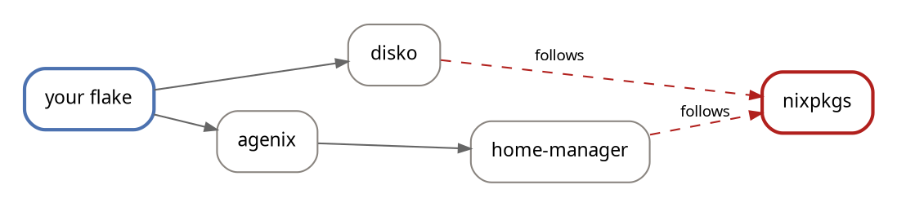

Flakes are undoubtedly here to stay, and I've made [my opinion](#flakes-are-meh ) on them well-known:
they are "meh".

Despite their ever-presence, adding a flake input continues to be 
a small annoyance that never goes away. It's touted as a positive feature that flakes are
federated but the reality is that I want the simplicity of a centralized flake. That was the beauty _and power_ of [nixpkgs](https://github.com/NixOS/nixpkgs/).


The process is: you want [disko](https://github.com/nix-community/disko), so you add a `url`, then a `follows` so it stops dragging in its own nixpkgs, and then you do it again for
the next one. This has become a meme in the Nix community about how every flake drags in its own [flake-utils](https://nixcademy.com/posts/1000-instances-of-flake-utils/).

I refuse to accept this user experience.

So I wondered: could **one** flake carry every other flake, and you just reach in
for whatever you need?  🤯

## Omniflake

[omniflake](https://github.com/fzakaria/omniflake) is **thousands of Nix flakes** behind one flake input.

```nix
inputs.omniflake.url = "github:fzakaria/omniflake";
inputs.omniflake.inputs.nixpkgs.follows = "nixpkgs";
```

Once you have omniflake, you can use it like any other input.

A package, in a shell or on a system:

```nix
environment.systemPackages = [
  omniflake.flakes.nh.packages.${system}.default
];
```

An overlay:

```nix
nixpkgs.overlays = [ omniflake.flakes.rust-overlay.overlays.default ];
```

A NixOS module:

```nix
imports = [ omniflake.flakes.disko.nixosModules.disko ];
```

Or nothing in a flake at all, straight from the command line:

```console
$ nix run 'github:fzakaria/omniflake#flakes.nh.packages.x86_64-linux.default' -- --version
```

It has an accessible website that you can visit <https://omniflake.com/> to see the list of flakes it carries, and some helpful documentation.

Once added, you have access to nearly **twelve thousand flakes**, as of this writing, that you can access as needed lazily. You only pay for what you use.

This sounds absurd but it works. A flake with thousands of inputs should be unusable
but thanks to the laziness of the Nix language and the flake lock mechanism it works
perfectly.

How is it possible to contain nearly every flake within this one?

## A very short primer on flakes

A flake is a directory with a `flake.nix` that declares two things: `inputs`
(other flakes it depends on) and `outputs` (a function of those inputs).

```nix
{
  inputs.nixpkgs.url = "github:NixOS/nixpkgs/nixos-unstable";
  outputs = { self, nixpkgs }: {
    packages.x86_64-linux.hello = nixpkgs.legacyPackages.x86_64-linux.hello;
  };
}
```

`inputs` says *what* you depend on, loosely: "nixos-unstable" is a moving
branch. The `flake.lock` next to it says *exactly* which commit that resolved to,
so the build is reproducible. It is npm's `package-lock.json`, or `Cargo.lock`.

A lock file does not just pin your own inputs. It pins the whole transitive graph
for every flake. That means if two child flakes both depend on `nixpkgs`, they will each have their own copy of `nixpkgs` in the lock file, and they may be different commits.


```json
{
  "nodes": {
    "root":    { "inputs": { "agenix": "agenix", "nixpkgs": "nixpkgs" } },
    "agenix":  { "inputs": { "home-manager": "home-manager" },
                 "locked": { "rev": "5182...", "type": "github" } },
    "home-manager": { "inputs": { "nixpkgs": "nixpkgs_2" }, ... },
    "nixpkgs":   { "locked": { "rev": "9fbb...", "type": "github" } },
    "nixpkgs_2": { "locked": { "rev": "50ab...", "type": "github" } }
  }
}
```

In this example **there are two nixpkgs**: `nixpkgs` and `nixpkgs_2`. This is the duplication everyone complains about, and it is why `follows` exists: `follows` rewrites a dependency to point at a node you already have, instead of fetching another copy. Doing this reduces the graph size _but_ it is no longer building against the exact nixpkgs the author tested against.

Here is a simple flake that uses `follows` to unify nixpkgs:

```nix
{
  inputs = {
    nixpkgs.url = "github:NixOS/nixpkgs/nixos-unstable";

    disko.url = "github:nix-community/disko";
    disko.inputs.nixpkgs.follows = "nixpkgs";

    agenix.url = "github:ryantm/agenix";
    agenix.inputs.home-manager.inputs.nixpkgs.follows = "nixpkgs";
  };
}
```



Solid arrows are inputs; dashed are `follows` edges collapsing onto one shared
nixpkgs.

## Inputs are lazy

The beauty of much of the craziness in Nix is that it is a lazy language. An input no output touches is never fetched.

You can prove this destructively: lock a flake with two inputs, then corrupt one entry in
`flake.lock` so it cannot possibly resolve.

```console
$ sed -i 's/2810303efc.../0000000000000000000000000000000000000000/' flake.lock
$ nix eval .#justB
[ "aarch64-darwin" "aarch64-linux" "x86_64-darwin" "x86_64-linux" ]
```

That evaluated fine against a lock containing a revision that does not exist.
Only forcing the poisoned input complains:

```console
$ nix eval .#useA
error: unable to download '.../0000000000000000000000000000000000000000.tar.gz': HTTP error 404
```

When you add a flake as an input, its entire transitive graph is
copied into your lock as *metadata*, nothing is fetched and nothing is evaluated.

```console
$ time nix flake lock
• Added input 'mega'
• Added input 'mega/a'          <- the poisoned one
• Added input 'mega/a/nixpkgs'
real    0m0.084s
```


## False start

My first attempt at creating a _massive single flake_ was to add every flake as an input directly into `flake.nix` and lock it.

```nix
{
  inputs = {
    nixpkgs.url = "github:NixOS/nixpkgs/nixos-unstable";

    agenix.url = "github:ryantm/agenix";
    agenix.inputs.nixpkgs.follows = "nixpkgs";

    disko.url = "github:nix-community/disko";
    disko.inputs.nixpkgs.follows = "nixpkgs";

    home-manager.url = "github:nix-community/home-manager";
    home-manager.inputs.nixpkgs.follows = "nixpkgs";

    # … 11,000 more …
  };
}
```

Surprisingly despite the laziness of Nix, evaluating an output that touches
nothing got **very slow** as inputs grew. The cost was not in evaluation. In order to create the lock file though the first time, Nix had to evaluate every input.

When Nix creates the lock file, every node needs a unique name, and a name collision is
resolved by appending `_2`, `_3` and so forth. The code would start the search at `_2` each time, and if there were 1,000 collisions, it would try `_2`, `_3`, … `_1000`

A megaflake guarantees collisions: every flake brings its own `systems` input, so 4,000 inputs produced 3,999 nodes named `systems_2` through `systems_4000`, about 8 million string
formats per evaluation. This turned out to be quadratic time complexity in the number of inputs, and it was the reason for the slowdown.

The fix was relatively simple: remember the highest suffix used per name and resume from
there. I submitted [NixOS/nix#16387](https://github.com/NixOS/nix/pull/16387), and
the lock files it writes are byte-identical to before.

```plotnine
import pandas as pd
from plotnine import *

# `nix eval` of a constant that touches no input, before and after the fix.
df = pd.DataFrame({
    "inputs": [500, 1000, 2000, 4000] * 2,
    "seconds": [0.64, 0.88, 3.05, 11.49] + [0.15, 0.16, 0.28, 0.54],
    "nix": ["stock"] * 4 + ["patched"] * 4,
})

plot = (
    ggplot(df, aes("inputs", "seconds", color="nix"))
    + geom_line(size=1.0)
    + geom_point(size=1.8)
    + scale_color_manual(values={"stock": "#b1201d", "patched": "#4c72b0"}, name="")
    + labs(x="flake inputs", y="seconds to evaluate a constant")
    + theme(legend_position="top", legend_title=element_blank())
)
plot.width, plot.height = 7.0, 3.6
```

No one had been writing absurdly large flakes, so this quadratic cost was invisible.
The fix was relatively simple and the speedup is dramatic: ~21x faster for 4,000 inputs.

Despite this fix, this turned out to be a false start. In order to finish creating the `flake.lock` file, Nix has to evaluate every input. Nix locks one input at a time, fetching each tree
to read its `flake.nix`, and one input that cannot be locked aborts the run.[^hack]

[^hack]: I tried assembling the lock file outside Nix from the `flake.lock` files directly for 
         each input but it kept disagreeing with `nix flake lock` and would cause Nix to redo the entire lock.


So I went to the source to find out what a consumer does with an inherited
lock. The answer is less than I assumed. When you add a flake as an input, Nix
checks that flake's *direct* inputs against its `flake.nix`, and copies
everything deeper into your lock unread. And when it evaluates, the code that
turns a lock into a flake does one thing per node: fetch the pinned tree,
import its `flake.nix`, call `outputs` with the inputs the lock names.

That is a table lookup and a fetch. Nothing about it needs the flakes to be
*inputs*.

## The flakes are not inputs

Turns out we can avoid `inputs` altogether. omniflake's `flake.nix` declares only five inputs, nixpkgs and four small other libraries.

It does include a table of pins (JSONL) for all the flakes. Each line of `index.json` is the same `locked` object a `flake.lock` entry holds, which is exactly what `builtins.fetchTree` needs to fetch a tree in pure evaluation mode:

```json
{
  "disko": {
    "locked": {
      "narHash": "sha256-RxWs…",
      "owner": "nix-community",
      "repo": "disko",
      "rev": "ff8702b4…",
      "type": "github"
    }
  }
}
```

Twelve thousand lines each representing a distinct flake, and reading them costs nothing until you ask for one specifically.

When a flake is requested, `omniflake.flakes.disko`, the library runs a small loader that replicates what Nix itself does with a lock file. 

The library fetches the pin, reads disko's own `flake.lock`, fetches and imports each input it names, and calls `outputs`. It supports `follows` and any other feature of a flake, because it is just evaluating the flake as Nix would.[^lock]

[^lock]: Some flakes do not have a `flake.lock` file. For those  flakes, we store a `flake.lock` in omniflake directly, so they can be evaluated as if they had one. This is a hack but it works.

The desire to keep our graphs small and avoid duplication is satisfied with the `overrides` attribute, which allows you to replace any input with your own.

omniflake offers a `flakes` attribute that is already heavily unified across many popular flakes, such as `nixpkgs` or a `pinned` attribute set that is every flake exactly as the author intended.

```nix
# nixpkgs and the four libraries are yours
omniflake.flakes.disko
# everything exactly as disko's author locked it
omniflake.pinned.disko
# your policy
omniflake.lib.withOverrides { nixpkgs = nixpkgs-stable; }
```

The flakes included are scraped from GitHub and updated automatically. Each flake is also updated periodically.


## Is this cursed?

Probably. The mechanism works and the ergonomics are what I wanted. 
I can avoid having to ever think about adding a single flake input again.

The performance is surprisingly good, because we only pay for what we use. Adding omniflake makes `nix flake lock` take around 1.5 seconds, inherits only six nodes, and downloads none
of the thousands of flakes behind them:

```console
$ time nix flake lock
real    0m1.5s
$ nix eval github:fzakaria/omniflake#lib.count
11975
```

I love the idea of federation but I want the simplicity of centralization. As Nix users, I want my cake and I want to eat it too: omniflake is my cake.