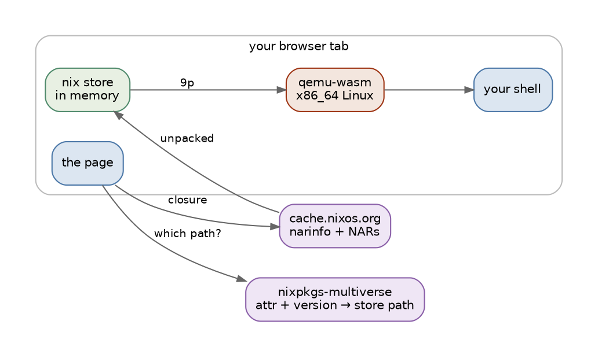

> **tl;dr** Try it at [https://trynix.dev](https://trynix.dev/). Click [hello](https://trynix.dev/?pkg=hello), or [python 3.6.2 from 2017](https://trynix.dev/?pkg=python3@3.6.2), or [two eras of hello at once](https://trynix.dev/?pkg=hello@2.10&pkg=hello@2.12.2), or [a package that exists in no public cache](https://trynix.dev/?path=/nix/store/awmhh7ci4admi71gs6b73awh0lxgrqqn-hello-trynix-2.12.3&cache=https://trynix.dev/examples/cache%20trynix-examples-1:dZOV2uGWvjHo6IC5ZqCCu0dmIRzLm9pyOQJBDnBsXRY=). A Linux machine boots in the tab and you get a shell with those Nix packages on `PATH`.
{: .alert .alert-note }

This is my _magnus opus_ of Nix work.

I knew all the ideas I have been creating were building blogs for something greater: [nixpkgs-multiverse]() indexed every version of every package nixpkgs ever shipped, [grail]() taught it version ranges and [omniflake]() allowed adding over sixteen thousand flakes from a single input.

The crazy insight I had lately was the craziness of the ["fast-mode"]() of the [nixmultiverse.com](https://nixmultiverse.com), which lets you skip evaluation and go straight to the store path.
This lets you leverage the amazingness of Nix without having to deal with
the complexity of evaluation and building. You can just ask for a package and get the exact store path that Hydra built for it, at any version it ever had.

If we have the produced binaries, we can run them. And if we can run them, we can run _any_ of them, in a browser tab, with nothing installed on the host machine.

Welcome to [trynix](https://trynix.dev/), a browser-based Nix package runner. You can browse the complete history of nixpkgs, over 310,083 package versions, and run any of them[^nogui] in a Linux machine that boots in your tab. It is a Nix store in memory, a Linux kernel in WebAssembly, and a [terminal emulator](https://github.com/ghostty-org/ghostty) in the page.

[^nogui]: It is a serial console, so nothing graphical. The machine boots to a shell, and you can run any command-line program in the store.

<video autoplay loop muted playsinline width="800" height="448">
  <source src="/assets/images/trynix-boot.mp4" type="video/mp4">
  <a href="/assets/images/trynix-boot.mp4">Screencast: searching nixpkgs for pfetch, picking a version, and booting it to a shell in the browser</a>
</video>

This is bonkers! 🤯
We can boot the VM with the store-path closure within seconds. Nothing is pre-installed: search, pick a version, boot, run it.

The craziest part? We are not restricted to the public cache. You can share a store path you built yourself, and anyone can boot it in their browser tab. The only requirement is that the cache is served with `access-control-allow-origin: *`, which GitHub Pages does for free[^github-pages], so does [Cachix](https://www.cachix.org/) and obviously
[cache.nixos.org](https://cache.nixos.org/) as well.

> In a unbelievable twist of fate, I had actually requested 5 years ago for [cache.nixos.org](https://cache.nixos.org/) to serve `access-control-allow-origin: *` via [issue#156](https://github.com/NixOS/infra/issues/156) to make it possible to query the cache from an [OpenAPI specification](https://fzakaria.github.io/nix-http-binary-cache-api-spec/) I had implemented. Thank you universe. 🙏

[^github-pages]: I was a little surprised to learn that GitHub Pages can work as a binary cache. It is just a static file server, and it serves `access-control-allow-origin: *` on every file. That is all that is needed to make a Nix store path available to [trynix](https://trynix.dev).

[This link boots](https://trynix.dev/?path=/nix/store/awmhh7ci4admi71gs6b73awh0lxgrqqn-hello-trynix-2.12.3&cache=https://trynix.dev/examples/cache%20trynix-examples-1:dZOV2uGWvjHo6IC5ZqCCu0dmIRzLm9pyOQJBDnBsXRY=) a VM with a store-path served from Github Pages of a [modified GNU hello](https://github.com/fzakaria/trynix/blob/f9a6fcd496cf3811fa8cf07d0af265b9eea969c9/examples/hello-trynix/flake.nix).
_This is a store path that does not exist on [cache.nixos.org](https://cache.nixos.org/) and yet it boots in your browser tab._

[](/assets/images/github_pages_modified_hello.png)


## Making the pieces fit

Since we can access store-paths from caches that serve `access-control-allow-origin: *`, that makes the browser a legitimate Nix client.

The missing piece the browser lacked was somewhere to _run_ the binaries since they store-paths are either x86-64 or aarch64 ELF executables.

Standing on the shoulders of giants, we can run a [Linux kernel in WebAssembly](https://github.com/ktock/qemu-wasm). This means we can boot a real x86_64 kernel inside our browser tab. Give that kernel a filesystem containing a Nix store. All that's left knowing which store-paths to fetch, which we beautifully solved with [nixpkgs-multiverse](https://nixmultiverse.com/). 🤌




I have to keep reminding myself: there is no server in the above picture, the web-page is purely static files and everything else is a publicly accessible cache. It is a virtual machine that exists only inside your tab. The ultimate embodiment of [Erase your darlings](https://grahamc.com/blog/erase-your-darlings/).

Since this is Nix, we get the simplicity of managing multiple versions of the same package. You can boot [two versions of hello](https://trynix.dev/?pkg=hello@2.10&pkg=hello@2.12.2) in one machine, and they will not conflict because each binary names its own dependencies by absolute path (`RUNPATH`) down to the loader and libc.

Once the VM is already started, you can add more store-paths to it while it's running. This is no different than adding more paths to your own `/nix/store` on your laptop. No reboot, or `dnf install`, or `apt-get install`, the site fetches the closure and adds it to the store.


## It has to feel instant

Booting a kernel under emulation is slow, and despite the amazingness of the idea, no one would use it if it took 30 seconds to get a shell.

The site employs some neat tricks to make it feel instant. The site pre-fetches the engine and the VM snapshot in the background, so by the time you click a link, you have already downloaded it.

The site also never boots the VM from scratch. It resumes. A machine is booted once, ahead of time, on a native build of the same QEMU, and paused at the moment before it mounts the store which is then saved to a snapshot.

Subsequent visits to the site have the engine and snapshot already in the browser cache, so the only thing that has to be fetched is the closure of the store-path you asked for. This makes each subsequent visit feel much faster.

```plotnine
import pandas as pd
from plotnine import *

# Measured 2026-09-05 against trynix.dev in headless Chromium on a
# Ryzen 7 7840U: three visits per package with a fresh browser profile,
# then a reload with everything already cached. Medians. The clock runs
# from opening the link to a prompt you can type at.
df = pd.DataFrame({
    "package": ["hello", "hello", "ripgrep", "ripgrep", "python3", "python3"],
    "visit": ["first visit", "revisit", "first visit", "revisit",
              "first visit", "revisit"],
    "seconds": [4.2, 1.5, 4.3, 1.7, 7.5, 3.5],
})
df["package"] = pd.Categorical(
    df["package"], categories=["python3", "ripgrep", "hello"], ordered=True
)
df["visit"] = pd.Categorical(
    df["visit"], categories=["first visit", "revisit"], ordered=True
)
df["label_at"] = df["seconds"] + 0.15

plot = (
    ggplot(df, aes("package", "seconds", fill="visit"))
    + geom_col(position=position_dodge(width=0.75), width=0.65)
    + geom_text(
        aes(y="label_at", label="seconds"),
        position=position_dodge(width=0.75),
        ha="left",
        size=8,
    )
    + coord_flip()
    + scale_fill_manual(values=["#4C78A8", "#A8C7E5"], name="")
    + labs(x="", y="seconds to a shell")
    + theme(figure_size=(6.5, 2.8), legend_position="top")
)
```

I have to give a lot of credit to LLMs here for helping find a lot of the performance opportunities and bottlenecks. What first started as a "neat idea" turned into an incredibly usable project with their help.

Despite all the performance work, it is still not instant. It is fast enough to be usable, but it is not instant. Execution of a binary is still slow, because it is running under emulation. The first time you run a binary, it is translated from x86_64 to WebAssembly and that takes time. Subsequent runs are faster, because the translation is cached in memory.

Lastly, we have an upper-bound on the size of the closure we can fetch. The whole closure has to fit in tab memory, which is set to a hard limit of ~1.5GiB as of now and WebAssembly has a hard limit of 4GiB as it is a 32-bit address space.

## More than a parlor trick

The demo is clearly fun and impressive, but is it more than a parlor trick? I have been thinking of _endless ideas_ of ways in which this could be a new way to use and leverage Nix.

**Reviewing a pull request by using the software.** If your CI already pushes to a cache, like Cachix, and if you use Nix, then a PR has produced real artifacts by the time a human looks at it. A bot can leave a link that boots exactly those artifacts. The reviewer does not clone, does not build, does not trust a screenshot. They click, and can immediately test out the software. "Does this fix the bug?" stops being a thought experiment.

**Agent Artifacts.** Agents can produce Nix store paths as artifacts, and those artifacts can be shared with humans or other agents. A bot can produce a store path, and another bot can boot it in a browser tab and run tests against it.

**Bug reports that carry their own environment.** "Works on my machine" is a URL now for reproduction.

**Documentation you can run.** A tutorial that names a tool version can link a shell with that exact version on `PATH`, pinned forever, with no install step standing between a reader and the first command.

**Archaeology.** You can run historic versions of software and explore their behavior. You can run a version of Python from 2017 and see what it does, or a version of `hello` from 2005 and see how it differs from today. This was already possible with Nix, but now you can do it in the browser.

The source is at [github.com/fzakaria/trynix](https://github.com/fzakaria/trynix). The Nix cache has quietly served an open CORS header for years, waiting to be ~~abused~~ used. [Go boot something old.](https://trynix.dev/?pkg=python2@2.7.18)
