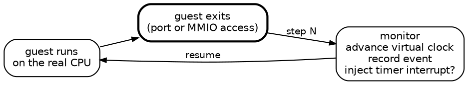

_If a test fails on CI and nobody can reproduce it, did it really fail?_ 🧘

Nix gives me a build that is a function of its inputs via the extensional model. 
The same derivation, produces the same store path, and if I am lucky, the same bytes.
What Nix does not give me is the same _run_.[^run]
A test suite with a race in it may pass on my laptop, fail once on
CI, and when I rebuild it to look, it passes again.

<!--more-->

[^run]: A run is the sequence of events that happen in a process to produce a result. A build is a run of a derivation.

If you have experienced bugs like this, you know that it can be frustrating.
You are effectively at times trying to find the _needle in the haystack_.

I wrote recently that [the Nix sandbox is a hidden input]() to a derivation. The same is true of the thread schedule. The order the kernel happens to run your processes in decides whether some builds pass, and nothing within the derivation records it.

These are the _hidden inputs_ to a build that can make it flaky.

[](/assets/images/ackchyually_nix_meme.png)
{: style="--image-width: 22rem"}

Are we left to hoping that we will find the needle in the haystack? Or is there a way to make the run a function of its inputs too?

I built [Rewind VM](https://rewindvm.dev) to make the schedule an input too. It
runs a Nix build, a test suite or any Linux command inside a KVM virtual machine
whose every run is a function of its inputs. <u>The same inputs give the same run,
at the same steps, every time</u>. You can replay a failure, scrub through it, read
any file as it was at any point, and fork it under a different thread interleaving. ✨

Confused? Yes it sounds like magic. The best way to explain it is with short demo.

## A textbook deadlock

Let's investigate the [dining philosophers](https://en.wikipedia.org/wiki/Dining_philosophers_problem) problem. The problem is that the five philosophers sit at a round table with a fork between each of them. A philosopher needs both forks beside them
to eat. A philosopher may pick up one fork at a time.[^world]

[^world]: The world is a metaphor for the thread scheduler. Each philosopher is a thread and each fork a mutex.

<figure>
<svg viewBox="0 0 380 360" role="img"
     style="display:block;margin-inline:auto;max-width:20rem;width:100%;height:auto;font-family:var(--mono)"
     aria-label="An animation of five philosophers, P0 to P4, around a table with forks f0 to f4 between them. P0 picks up two forks and eats, then puts them down, then P2 does the same. Then every philosopher picks up the fork on their left, each waits for the fork on their right, and the five waits close a ring: deadlock.">
  <style>
    @keyframes dp-k1{0.000%{opacity:0}6.250%{opacity:1}12.500%{opacity:1}18.750%{opacity:0}25.000%{opacity:0}31.250%{opacity:0}37.500%{opacity:0}43.750%{opacity:1}50.000%{opacity:1}56.250%{opacity:1}62.500%{opacity:1}68.750%{opacity:1}75.000%{opacity:1}81.250%{opacity:1}87.500%{opacity:1}93.750%{opacity:1}}
    .dp-k1{opacity:1;animation:dp-k1 17.6s step-end infinite}
    @keyframes dp-k2{0.000%{opacity:0}6.250%{opacity:0}12.500%{opacity:1}18.750%{opacity:0}25.000%{opacity:0}31.250%{opacity:0}37.500%{opacity:0}43.750%{opacity:0}50.000%{opacity:0}56.250%{opacity:0}62.500%{opacity:0}68.750%{opacity:0}75.000%{opacity:0}81.250%{opacity:0}87.500%{opacity:0}93.750%{opacity:0}}
    .dp-k2{opacity:0;animation:dp-k2 17.6s step-end infinite}
    @keyframes dp-k3{0.000%{opacity:0}6.250%{opacity:0}12.500%{opacity:0}18.750%{opacity:0}25.000%{opacity:0}31.250%{opacity:0}37.500%{opacity:0}43.750%{opacity:0}50.000%{opacity:1}56.250%{opacity:1}62.500%{opacity:1}68.750%{opacity:1}75.000%{opacity:1}81.250%{opacity:1}87.500%{opacity:1}93.750%{opacity:1}}
    .dp-k3{opacity:1;animation:dp-k3 17.6s step-end infinite}
    @keyframes dp-k4{0.000%{opacity:0}6.250%{opacity:0}12.500%{opacity:0}18.750%{opacity:0}25.000%{opacity:1}31.250%{opacity:1}37.500%{opacity:0}43.750%{opacity:0}50.000%{opacity:0}56.250%{opacity:1}62.500%{opacity:1}68.750%{opacity:1}75.000%{opacity:1}81.250%{opacity:1}87.500%{opacity:1}93.750%{opacity:1}}
    .dp-k4{opacity:1;animation:dp-k4 17.6s step-end infinite}
    @keyframes dp-k5{0.000%{opacity:0}6.250%{opacity:0}12.500%{opacity:0}18.750%{opacity:0}25.000%{opacity:0}31.250%{opacity:1}37.500%{opacity:0}43.750%{opacity:0}50.000%{opacity:0}56.250%{opacity:0}62.500%{opacity:0}68.750%{opacity:0}75.000%{opacity:0}81.250%{opacity:0}87.500%{opacity:0}93.750%{opacity:0}}
    .dp-k5{opacity:0;animation:dp-k5 17.6s step-end infinite}
    @keyframes dp-k6{0.000%{opacity:0}6.250%{opacity:0}12.500%{opacity:0}18.750%{opacity:0}25.000%{opacity:0}31.250%{opacity:0}37.500%{opacity:0}43.750%{opacity:0}50.000%{opacity:0}56.250%{opacity:0}62.500%{opacity:1}68.750%{opacity:1}75.000%{opacity:1}81.250%{opacity:1}87.500%{opacity:1}93.750%{opacity:1}}
    .dp-k6{opacity:1;animation:dp-k6 17.6s step-end infinite}
    @keyframes dp-k7{0.000%{opacity:0}6.250%{opacity:0}12.500%{opacity:0}18.750%{opacity:0}25.000%{opacity:0}31.250%{opacity:0}37.500%{opacity:0}43.750%{opacity:0}50.000%{opacity:0}56.250%{opacity:0}62.500%{opacity:0}68.750%{opacity:1}75.000%{opacity:1}81.250%{opacity:1}87.500%{opacity:1}93.750%{opacity:1}}
    .dp-k7{opacity:1;animation:dp-k7 17.6s step-end infinite}
    @keyframes dp-k8{0.000%{opacity:0}6.250%{opacity:0}12.500%{opacity:0}18.750%{opacity:0}25.000%{opacity:0}31.250%{opacity:0}37.500%{opacity:0}43.750%{opacity:0}50.000%{opacity:0}56.250%{opacity:0}62.500%{opacity:0}68.750%{opacity:0}75.000%{opacity:1}81.250%{opacity:1}87.500%{opacity:1}93.750%{opacity:1}}
    .dp-k8{opacity:1;animation:dp-k8 17.6s step-end infinite}
    @keyframes dp-k9{0.000%{opacity:0}6.250%{opacity:0}12.500%{opacity:0}18.750%{opacity:0}25.000%{opacity:0}31.250%{opacity:0}37.500%{opacity:0}43.750%{opacity:0}50.000%{opacity:0}56.250%{opacity:0}62.500%{opacity:0}68.750%{opacity:0}75.000%{opacity:1}81.250%{opacity:1}87.500%{opacity:1}93.750%{opacity:1}}
    .dp-k9{opacity:1;animation:dp-k9 17.6s step-end infinite}
    @keyframes dp-k10{0.000%{opacity:0}6.250%{opacity:0}12.500%{opacity:0}18.750%{opacity:0}25.000%{opacity:0}31.250%{opacity:0}37.500%{opacity:0}43.750%{opacity:0}50.000%{opacity:0}56.250%{opacity:0}62.500%{opacity:0}68.750%{opacity:0}75.000%{opacity:1}81.250%{opacity:1}87.500%{opacity:1}93.750%{opacity:1}}
    .dp-k10{opacity:1;animation:dp-k10 17.6s step-end infinite}
    @keyframes dp-k11{0.000%{opacity:0}6.250%{opacity:0}12.500%{opacity:0}18.750%{opacity:0}25.000%{opacity:0}31.250%{opacity:0}37.500%{opacity:0}43.750%{opacity:0}50.000%{opacity:0}56.250%{opacity:0}62.500%{opacity:0}68.750%{opacity:0}75.000%{opacity:1}81.250%{opacity:1}87.500%{opacity:1}93.750%{opacity:1}}
    .dp-k11{opacity:1;animation:dp-k11 17.6s step-end infinite}
    @keyframes dp-k12{0.000%{opacity:0}6.250%{opacity:0}12.500%{opacity:0}18.750%{opacity:0}25.000%{opacity:0}31.250%{opacity:0}37.500%{opacity:0}43.750%{opacity:0}50.000%{opacity:0}56.250%{opacity:0}62.500%{opacity:0}68.750%{opacity:0}75.000%{opacity:1}81.250%{opacity:1}87.500%{opacity:1}93.750%{opacity:1}}
    .dp-k12{opacity:1;animation:dp-k12 17.6s step-end infinite}
    @keyframes dp-k13{0.000%{opacity:0}6.250%{opacity:0}12.500%{opacity:1}18.750%{opacity:0}25.000%{opacity:0}31.250%{opacity:0}37.500%{opacity:0}43.750%{opacity:0}50.000%{opacity:0}56.250%{opacity:0}62.500%{opacity:0}68.750%{opacity:0}75.000%{opacity:0}81.250%{opacity:0}87.500%{opacity:0}93.750%{opacity:0}}
    .dp-k13{opacity:0;animation:dp-k13 17.6s step-end infinite}
    @keyframes dp-k14{0.000%{opacity:0}6.250%{opacity:0}12.500%{opacity:0}18.750%{opacity:0}25.000%{opacity:0}31.250%{opacity:0}37.500%{opacity:0}43.750%{opacity:0}50.000%{opacity:0}56.250%{opacity:0}62.500%{opacity:0}68.750%{opacity:0}75.000%{opacity:0}81.250%{opacity:0}87.500%{opacity:0}93.750%{opacity:0}}
    .dp-k14{opacity:0;animation:dp-k14 17.6s step-end infinite}
    @keyframes dp-k15{0.000%{opacity:0}6.250%{opacity:0}12.500%{opacity:0}18.750%{opacity:0}25.000%{opacity:0}31.250%{opacity:1}37.500%{opacity:0}43.750%{opacity:0}50.000%{opacity:0}56.250%{opacity:0}62.500%{opacity:0}68.750%{opacity:0}75.000%{opacity:0}81.250%{opacity:0}87.500%{opacity:0}93.750%{opacity:0}}
    .dp-k15{opacity:0;animation:dp-k15 17.6s step-end infinite}
    @keyframes dp-k16{0.000%{opacity:0}6.250%{opacity:0}12.500%{opacity:0}18.750%{opacity:0}25.000%{opacity:0}31.250%{opacity:0}37.500%{opacity:0}43.750%{opacity:0}50.000%{opacity:0}56.250%{opacity:0}62.500%{opacity:0}68.750%{opacity:0}75.000%{opacity:0}81.250%{opacity:0}87.500%{opacity:0}93.750%{opacity:0}}
    .dp-k16{opacity:0;animation:dp-k16 17.6s step-end infinite}
    @keyframes dp-k17{0.000%{opacity:0}6.250%{opacity:0}12.500%{opacity:0}18.750%{opacity:0}25.000%{opacity:0}31.250%{opacity:0}37.500%{opacity:0}43.750%{opacity:0}50.000%{opacity:0}56.250%{opacity:0}62.500%{opacity:0}68.750%{opacity:0}75.000%{opacity:0}81.250%{opacity:0}87.500%{opacity:0}93.750%{opacity:0}}
    .dp-k17{opacity:0;animation:dp-k17 17.6s step-end infinite}
    @keyframes dp-k18{0.000%{opacity:1}6.250%{opacity:0}12.500%{opacity:0}18.750%{opacity:0}25.000%{opacity:0}31.250%{opacity:0}37.500%{opacity:0}43.750%{opacity:0}50.000%{opacity:0}56.250%{opacity:0}62.500%{opacity:0}68.750%{opacity:0}75.000%{opacity:0}81.250%{opacity:0}87.500%{opacity:0}93.750%{opacity:0}}
    .dp-k18{opacity:0;animation:dp-k18 17.6s step-end infinite}
    @keyframes dp-k19{0.000%{opacity:0}6.250%{opacity:1}12.500%{opacity:0}18.750%{opacity:0}25.000%{opacity:0}31.250%{opacity:0}37.500%{opacity:0}43.750%{opacity:0}50.000%{opacity:0}56.250%{opacity:0}62.500%{opacity:0}68.750%{opacity:0}75.000%{opacity:0}81.250%{opacity:0}87.500%{opacity:0}93.750%{opacity:0}}
    .dp-k19{opacity:0;animation:dp-k19 17.6s step-end infinite}
    @keyframes dp-k20{0.000%{opacity:0}6.250%{opacity:0}12.500%{opacity:1}18.750%{opacity:0}25.000%{opacity:0}31.250%{opacity:0}37.500%{opacity:0}43.750%{opacity:0}50.000%{opacity:0}56.250%{opacity:0}62.500%{opacity:0}68.750%{opacity:0}75.000%{opacity:0}81.250%{opacity:0}87.500%{opacity:0}93.750%{opacity:0}}
    .dp-k20{opacity:0;animation:dp-k20 17.6s step-end infinite}
    @keyframes dp-k21{0.000%{opacity:0}6.250%{opacity:0}12.500%{opacity:0}18.750%{opacity:1}25.000%{opacity:0}31.250%{opacity:0}37.500%{opacity:0}43.750%{opacity:0}50.000%{opacity:0}56.250%{opacity:0}62.500%{opacity:0}68.750%{opacity:0}75.000%{opacity:0}81.250%{opacity:0}87.500%{opacity:0}93.750%{opacity:0}}
    .dp-k21{opacity:0;animation:dp-k21 17.6s step-end infinite}
    @keyframes dp-k22{0.000%{opacity:0}6.250%{opacity:0}12.500%{opacity:0}18.750%{opacity:0}25.000%{opacity:1}31.250%{opacity:0}37.500%{opacity:0}43.750%{opacity:0}50.000%{opacity:0}56.250%{opacity:0}62.500%{opacity:0}68.750%{opacity:0}75.000%{opacity:0}81.250%{opacity:0}87.500%{opacity:0}93.750%{opacity:0}}
    .dp-k22{opacity:0;animation:dp-k22 17.6s step-end infinite}
    @keyframes dp-k23{0.000%{opacity:0}6.250%{opacity:0}12.500%{opacity:0}18.750%{opacity:0}25.000%{opacity:0}31.250%{opacity:1}37.500%{opacity:0}43.750%{opacity:0}50.000%{opacity:0}56.250%{opacity:0}62.500%{opacity:0}68.750%{opacity:0}75.000%{opacity:0}81.250%{opacity:0}87.500%{opacity:0}93.750%{opacity:0}}
    .dp-k23{opacity:0;animation:dp-k23 17.6s step-end infinite}
    @keyframes dp-k24{0.000%{opacity:0}6.250%{opacity:0}12.500%{opacity:0}18.750%{opacity:0}25.000%{opacity:0}31.250%{opacity:0}37.500%{opacity:1}43.750%{opacity:0}50.000%{opacity:0}56.250%{opacity:0}62.500%{opacity:0}68.750%{opacity:0}75.000%{opacity:0}81.250%{opacity:0}87.500%{opacity:0}93.750%{opacity:0}}
    .dp-k24{opacity:0;animation:dp-k24 17.6s step-end infinite}
    @keyframes dp-k25{0.000%{opacity:0}6.250%{opacity:0}12.500%{opacity:0}18.750%{opacity:0}25.000%{opacity:0}31.250%{opacity:0}37.500%{opacity:0}43.750%{opacity:1}50.000%{opacity:1}56.250%{opacity:1}62.500%{opacity:1}68.750%{opacity:1}75.000%{opacity:0}81.250%{opacity:0}87.500%{opacity:0}93.750%{opacity:0}}
    .dp-k25{opacity:0;animation:dp-k25 17.6s step-end infinite}
    @keyframes dp-k26{0.000%{opacity:0}6.250%{opacity:0}12.500%{opacity:0}18.750%{opacity:0}25.000%{opacity:0}31.250%{opacity:0}37.500%{opacity:0}43.750%{opacity:0}50.000%{opacity:0}56.250%{opacity:0}62.500%{opacity:0}68.750%{opacity:0}75.000%{opacity:1}81.250%{opacity:1}87.500%{opacity:0}93.750%{opacity:0}}
    .dp-k26{opacity:0;animation:dp-k26 17.6s step-end infinite}
    @keyframes dp-k27{0.000%{opacity:0}6.250%{opacity:0}12.500%{opacity:0}18.750%{opacity:0}25.000%{opacity:0}31.250%{opacity:0}37.500%{opacity:0}43.750%{opacity:0}50.000%{opacity:0}56.250%{opacity:0}62.500%{opacity:0}68.750%{opacity:0}75.000%{opacity:0}81.250%{opacity:0}87.500%{opacity:1}93.750%{opacity:1}}
    .dp-k27{opacity:1;animation:dp-k27 17.6s step-end infinite}
    @media (prefers-reduced-motion: reduce) { [class^="dp-k"] { animation: none } }
  </style>
  <defs>
    <marker id="dp-wait" viewBox="0 0 10 10" refX="8" refY="5" markerWidth="6" markerHeight="6" orient="auto-start-reverse">
      <path d="M0,0 L10,5 L0,10 z" fill="#b1201d"/>
    </marker>
  </defs>
  <circle cx="190" cy="168" r="78" fill="currentColor" opacity="0.06"/>
  <g class="dp-k1"><line x1="202.3" y1="79.5" x2="222.7" y2="111.9" stroke="currentColor" stroke-width="3.5" stroke-linecap="round"/></g>
  <g class="dp-k2"><line x1="177.7" y1="79.5" x2="157.3" y2="111.9" stroke="currentColor" stroke-width="3.5" stroke-linecap="round"/></g>
  <g class="dp-k3"><line x1="109.6" y1="129.0" x2="146.8" y2="119.6" stroke="currentColor" stroke-width="3.5" stroke-linecap="round"/></g>
  <g class="dp-k4"><line x1="128.0" y1="232.4" x2="130.6" y2="194.1" stroke="currentColor" stroke-width="3.5" stroke-linecap="round"/></g>
  <g class="dp-k5"><line x1="147.9" y1="246.8" x2="183.5" y2="232.6" stroke="currentColor" stroke-width="3.5" stroke-linecap="round"/></g>
  <g class="dp-k6"><line x1="232.1" y1="246.8" x2="196.5" y2="232.6" stroke="currentColor" stroke-width="3.5" stroke-linecap="round"/></g>
  <g class="dp-k7"><line x1="278.0" y1="152.3" x2="253.4" y2="181.8" stroke="currentColor" stroke-width="3.5" stroke-linecap="round"/></g>
  <g class="dp-k8"><line x1="177.7" y1="79.5" x2="159.4" y2="108.5" stroke="#b1201d" stroke-width="2" stroke-dasharray="5 4" marker-end="url(#dp-wait)"/></g>
  <g class="dp-k9"><line x1="102.0" y1="152.3" x2="124.0" y2="178.7" stroke="#b1201d" stroke-width="2" stroke-dasharray="5 4" marker-end="url(#dp-wait)"/></g>
  <g class="dp-k10"><line x1="147.9" y1="246.8" x2="179.8" y2="234.1" stroke="#b1201d" stroke-width="2" stroke-dasharray="5 4" marker-end="url(#dp-wait)"/></g>
  <g class="dp-k11"><line x1="252.0" y1="232.4" x2="249.7" y2="198.1" stroke="#b1201d" stroke-width="2" stroke-dasharray="5 4" marker-end="url(#dp-wait)"/></g>
  <g class="dp-k12"><line x1="270.4" y1="129.0" x2="237.1" y2="120.5" stroke="#b1201d" stroke-width="2" stroke-dasharray="5 4" marker-end="url(#dp-wait)"/></g>
  <rect x="220.4" y="111.8" width="12" height="12" rx="2" fill="currentColor"/>
  <text x="213.5" y="139.6" font-size="13" text-anchor="middle" fill="currentColor" opacity="0.75">f0</text>
  <rect x="147.6" y="111.8" width="12" height="12" rx="2" fill="currentColor"/>
  <text x="166.5" y="139.6" font-size="13" text-anchor="middle" fill="currentColor" opacity="0.75">f1</text>
  <rect x="125.0" y="181.2" width="12" height="12" rx="2" fill="currentColor"/>
  <text x="152.0" y="184.4" font-size="13" text-anchor="middle" fill="currentColor" opacity="0.75">f2</text>
  <rect x="184.0" y="224.0" width="12" height="12" rx="2" fill="currentColor"/>
  <text x="190.0" y="212.0" font-size="13" text-anchor="middle" fill="currentColor" opacity="0.75">f3</text>
  <rect x="243.0" y="181.2" width="12" height="12" rx="2" fill="currentColor"/>
  <text x="228.0" y="184.4" font-size="13" text-anchor="middle" fill="currentColor" opacity="0.75">f4</text>
  <circle cx="190.0" cy="60.0" r="21" fill="var(--paper, transparent)" stroke="currentColor" stroke-width="1.5"/>
  <text x="190.0" y="65.0" font-size="16" font-weight="600" text-anchor="middle" fill="currentColor">P0</text>
  <g class="dp-k13"><text x="190.0" y="27.0" font-size="14" font-weight="600" text-anchor="middle" fill="currentColor">eats</text></g>
  <circle cx="87.3" cy="134.6" r="21" fill="var(--paper, transparent)" stroke="currentColor" stroke-width="1.5"/>
  <text x="87.3" y="139.6" font-size="16" font-weight="600" text-anchor="middle" fill="currentColor">P1</text>
  <g class="dp-k14"><text x="51.1" y="127.9" font-size="14" font-weight="600" text-anchor="middle" fill="currentColor">eats</text></g>
  <circle cx="126.5" cy="255.4" r="21" fill="var(--paper, transparent)" stroke="currentColor" stroke-width="1.5"/>
  <text x="126.5" y="260.4" font-size="16" font-weight="600" text-anchor="middle" fill="currentColor">P2</text>
  <g class="dp-k15"><text x="104.2" y="291.1" font-size="14" font-weight="600" text-anchor="middle" fill="currentColor">eats</text></g>
  <circle cx="253.5" cy="255.4" r="21" fill="var(--paper, transparent)" stroke="currentColor" stroke-width="1.5"/>
  <text x="253.5" y="260.4" font-size="16" font-weight="600" text-anchor="middle" fill="currentColor">P3</text>
  <g class="dp-k16"><text x="275.8" y="291.1" font-size="14" font-weight="600" text-anchor="middle" fill="currentColor">eats</text></g>
  <circle cx="292.7" cy="134.6" r="21" fill="var(--paper, transparent)" stroke="currentColor" stroke-width="1.5"/>
  <text x="292.7" y="139.6" font-size="16" font-weight="600" text-anchor="middle" fill="currentColor">P4</text>
  <g class="dp-k17"><text x="328.9" y="127.9" font-size="14" font-weight="600" text-anchor="middle" fill="currentColor">eats</text></g>
  <g class="dp-k18"><text x="190" y="345" font-size="15" text-anchor="middle" fill="currentColor">five philosophers, five forks</text></g>
  <g class="dp-k19"><text x="190" y="345" font-size="15" text-anchor="middle" fill="currentColor">P0 picks up f0</text></g>
  <g class="dp-k20"><text x="190" y="345" font-size="15" text-anchor="middle" fill="currentColor">P0 picks up f1 and eats</text></g>
  <g class="dp-k21"><text x="190" y="345" font-size="15" text-anchor="middle" fill="currentColor">P0 puts both down</text></g>
  <g class="dp-k22"><text x="190" y="345" font-size="15" text-anchor="middle" fill="currentColor">P2 picks up f2</text></g>
  <g class="dp-k23"><text x="190" y="345" font-size="15" text-anchor="middle" fill="currentColor">P2 picks up f3 and eats</text></g>
  <g class="dp-k24"><text x="190" y="345" font-size="15" text-anchor="middle" fill="currentColor">P2 puts both down</text></g>
  <g class="dp-k25"><text x="190" y="345" font-size="15" text-anchor="middle" fill="currentColor">everyone reaches for the left fork</text></g>
  <g class="dp-k26"><text x="190" y="345" font-size="15" text-anchor="middle" fill="#b1201d">each waits on a neighbor&#39;s fork</text></g>
  <g class="dp-k27"><text x="190" y="345" font-size="15" text-anchor="middle" fill="#b1201d">nobody can ever eat: deadlock</text></g>
</svg>
<figcaption>The philosophers take turns, until all five pick up their left fork at once.</figcaption>
</figure>

```c
/* The fork on the left first, then the fork on the right. */
int first = left;
int second = right;

/* Eat MEALS times, holding both forks for each meal. */
for (int meal = 0; meal < MEALS; meal++) {
  pthread_mutex_lock(&forks[first]);
  printf("philosopher %d picks up fork %d\n", id, first);
  pthread_mutex_lock(&forks[second]);
  printf("philosopher %d picks up fork %d and eats\n", id, second);
  pthread_mutex_unlock(&forks[second]);
  pthread_mutex_unlock(&forks[first]);
}
```

If all five pick up their left fork before any of them reaches for a right
one, every fork is taken and every philosopher waits on a neighbor who is
also waiting. **Deadlock**.[^timeout]

[^timeout]: The program stops making progress and never exits, so the check phase runs it under `timeout 10`, which kills it and exits with status 124.

On my laptop 14 of 100 rebuilds deadlocked. 💣

```console
$ nix build --rebuild -L github:fzakaria/rewindvm#philosophers
...
philosophers> philosopher 3 picks up fork 3
philosophers> philosopher 0 picks up fork 0
philosophers> philosopher 4 picks up fork 4
philosophers> philosopher 2 picks up fork 2
philosophers> philosopher 1 picks up fork 1
philosophers> make: *** [Makefile:14: check] Error 124
error: Cannot build '/nix/store/fp2dx8yh62kik2nknqmjzrga0d9yd75s-philosophers-0.1.0.drv'.
```

`rewind nix` builds the same derivation the way the Nix sandbox would, inside
the deterministic VM.

```console?comments=true
$ rewind nix github:fzakaria/rewindvm#philosophers
rewind: packing 62 store paths for philosophers-0.1.0
...
rewind: run 1b21bf17737bcb37 exited:0 after 4583 steps, 0.126s virtual, 6.146s wall (poweroff)
# the hash of the output tree, compared against the host's build
/nix/store/g0zkyzprrlhrnw8sf42xl49gjn2lzq62-philosophers-0.1.0 fad5714e2ad61159 (same as the host's build)
```

Oh darn, it passed! That means it will pass forever right? Not quite. The VM is deterministic, but the guest kernel's scheduler is not. It can reschedule threads at different points in the program, and that can change the outcome.

To find the other interleavings, `rewind check` runs the
build again under **perturbed schedules**, we effectively ask the guest kernel
to reschedule at different steps which causes a different sequence of events.

```console?comments=true
$ rewind check github:fzakaria/rewindvm#philosophers
schedule   0: exited:0             4583 steps  fad5714e2ad6  run 1b21bf17737bcb37
schedule   1: exited:2             6483 steps    run 83be7294525ddb91
schedule   2: exited:0             5396 steps  fad5714e2ad6  run 6d76063661b1010b
schedule   3: exited:2             7503 steps    run 800c0f86aef3116b
# 13 more schedules omitted
...

schedule 1 ends differently; narrowing the steps it perturbs
perturbing only steps 1748..3461 still ends differently

passing: run 1b21bf17737bcb37
failing: run b0739df0eacce572

```

`rewind check` runs one VM per core by default and stops after the first batch of schedules where the exit code differs.

> **Note**
> A failing schedule on its own is not that super helpful. Schedule 1 which had deadlocked likely perturbs every step from the start of the build to the end, and most of those perturbations have nothing to do with the deadlock. 
> To help with this, `check` narrows it: it shrinks the window
> of steps the schedule may perturb, first pulling in the end and then the start, reruns the build for each candidate window, and keeps the smallest one that still deadlocks.
{: .alert .alert-note }

For our deadlock problem, it might be easier to see the last few lines of the log and see that all five philosophers have picked up their left fork and are waiting for the right one.

```console
$ rewind log b0739df0 | tail -6
philosopher 0 picks up fork 0
philosopher 3 picks up fork 3
philosopher 4 picks up fork 4
philosopher 1 picks up fork 1
philosopher 2 picks up fork 2
make: *** [Makefile:14: check] Error 124
```

We can also inspect the events, which are the same as the log but with timestamps and thread IDs.

```console
$ rewind events b0739df0 | grep -A1 'philosopher 2 picks up fork 2'
      3470   140/143   write(1, "philosopher 2 picks up fork 2\n")
      4243   139/139   SIGALRM code=-2 addr=0x0
```

What if I'm not familiar with the VM? Can we look around? Yes!

`rewind shell` drops you into a shell inside the VM at any step, in a process's working directory, with the build's environment, while everything else in the VM stays stopped. We can use `--with nixpkgs#gdb` to bring gdb into that shell, and gdb can attach to the stuck process.[^gdb]

[^gdb]: There is actually native support for gdb in the VM already. You can also use `--with` to bring in any other tool you want to use.

```console
$ rewind shell b0739df0 3471 --pid 140 --with nixpkgs#gdb
rewind: a shell at step 3471 of b0739df0eacce572; exit it to leave
[rewind] /build/philosophers # gdb -q -batch -p 140 -ex 'thread apply all -q frame function dine' -ex 'python print([int(gdb.parse_and_eval(f"forks[{i}].__data.__owner")) for i in range(5)])' 2>/dev/null
...
#2  0x0000560d082a0237 in dine (arg=<optimized out>) at philosophers.c:27
27			pthread_mutex_lock(&forks[second]);
#2  0x0000560d082a0237 in dine (arg=<optimized out>) at philosophers.c:27
27			pthread_mutex_lock(&forks[second]);
#2  0x0000560d082a0237 in dine (arg=<optimized out>) at philosophers.c:27
27			pthread_mutex_lock(&forks[second]);
#2  0x0000560d082a0237 in dine (arg=<optimized out>) at philosophers.c:27
27			pthread_mutex_lock(&forks[second]);
#2  0x0000560d082a0237 in dine (arg=<optimized out>) at philosophers.c:27
27			pthread_mutex_lock(&forks[second]);
[141, 142, 143, 144, 145]
```

All five philosophers are on line 27, waiting for their second fork.


<figure>
<svg viewBox="0 0 380 345" role="img"
     style="display:block;margin-inline:auto;max-width:16rem;width:100%;height:auto;font-family:var(--mono)"
     aria-label="A round table of five philosophers, P0 to P4, with forks f0 to f4 between them. Every philosopher has picked up the left fork first: each holds one fork and waits for the next, and the five waits close a ring.">
  <defs>
    <marker id="left-first-wait" viewBox="0 0 10 10" refX="8" refY="5" markerWidth="6" markerHeight="6" orient="auto-start-reverse">
      <path d="M0,0 L10,5 L0,10 z" fill="#b1201d"/>
    </marker>
  </defs>
  <circle cx="190" cy="150" r="78" fill="currentColor" opacity="0.06"/>
  <line x1="202.3" y1="61.5" x2="222.7" y2="93.9" stroke="currentColor" stroke-width="3.5" stroke-linecap="round"/>
  <line x1="109.6" y1="111.0" x2="146.8" y2="101.6" stroke="currentColor" stroke-width="3.5" stroke-linecap="round"/>
  <line x1="128.0" y1="214.4" x2="130.6" y2="176.1" stroke="currentColor" stroke-width="3.5" stroke-linecap="round"/>
  <line x1="232.1" y1="228.8" x2="196.5" y2="214.6" stroke="currentColor" stroke-width="3.5" stroke-linecap="round"/>
  <line x1="278.0" y1="134.3" x2="253.4" y2="163.8" stroke="currentColor" stroke-width="3.5" stroke-linecap="round"/>
  <line x1="177.7" y1="61.5" x2="159.4" y2="90.5" stroke="#b1201d" stroke-width="2" stroke-dasharray="5 4" marker-end="url(#left-first-wait)"/>
  <line x1="102.0" y1="134.3" x2="124.0" y2="160.7" stroke="#b1201d" stroke-width="2" stroke-dasharray="5 4" marker-end="url(#left-first-wait)"/>
  <line x1="147.9" y1="228.8" x2="179.8" y2="216.1" stroke="#b1201d" stroke-width="2" stroke-dasharray="5 4" marker-end="url(#left-first-wait)"/>
  <line x1="252.0" y1="214.4" x2="249.7" y2="180.1" stroke="#b1201d" stroke-width="2" stroke-dasharray="5 4" marker-end="url(#left-first-wait)"/>
  <line x1="270.4" y1="111.0" x2="237.1" y2="102.5" stroke="#b1201d" stroke-width="2" stroke-dasharray="5 4" marker-end="url(#left-first-wait)"/>
  <rect x="220.4" y="93.8" width="12" height="12" rx="2" fill="currentColor"/>
  <text x="213.5" y="121.6" font-size="13" text-anchor="middle" fill="currentColor" opacity="0.75">f0</text>
  <rect x="147.6" y="93.8" width="12" height="12" rx="2" fill="currentColor"/>
  <text x="166.5" y="121.6" font-size="13" text-anchor="middle" fill="currentColor" opacity="0.75">f1</text>
  <rect x="125.0" y="163.2" width="12" height="12" rx="2" fill="currentColor"/>
  <text x="152.0" y="166.4" font-size="13" text-anchor="middle" fill="currentColor" opacity="0.75">f2</text>
  <rect x="184.0" y="206.0" width="12" height="12" rx="2" fill="currentColor"/>
  <text x="190.0" y="194.0" font-size="13" text-anchor="middle" fill="currentColor" opacity="0.75">f3</text>
  <rect x="243.0" y="163.2" width="12" height="12" rx="2" fill="currentColor"/>
  <text x="228.0" y="166.4" font-size="13" text-anchor="middle" fill="currentColor" opacity="0.75">f4</text>
  <circle cx="190.0" cy="42.0" r="21" fill="var(--paper, transparent)" stroke="currentColor" stroke-width="1.5"/>
  <text x="190.0" y="47.0" font-size="16" font-weight="600" text-anchor="middle" fill="currentColor">P0</text>
  <circle cx="87.3" cy="116.6" r="21" fill="var(--paper, transparent)" stroke="currentColor" stroke-width="1.5"/>
  <text x="87.3" y="121.6" font-size="16" font-weight="600" text-anchor="middle" fill="currentColor">P1</text>
  <circle cx="126.5" cy="237.4" r="21" fill="var(--paper, transparent)" stroke="currentColor" stroke-width="1.5"/>
  <text x="126.5" y="242.4" font-size="16" font-weight="600" text-anchor="middle" fill="currentColor">P2</text>
  <circle cx="253.5" cy="237.4" r="21" fill="var(--paper, transparent)" stroke="currentColor" stroke-width="1.5"/>
  <text x="253.5" y="242.4" font-size="16" font-weight="600" text-anchor="middle" fill="currentColor">P3</text>
  <circle cx="292.7" cy="116.6" r="21" fill="var(--paper, transparent)" stroke="currentColor" stroke-width="1.5"/>
  <text x="292.7" y="121.6" font-size="16" font-weight="600" text-anchor="middle" fill="currentColor">P4</text>
  <text x="190" y="312" fill="currentColor" font-size="16" font-weight="600" text-anchor="middle">left fork first</text>
  <text x="190" y="332" fill="#b1201d" font-size="14" text-anchor="middle">every wait is on a held fork: a ring</text>
</svg>
</figure>

`rewind cat`, `rewind shell` and `rewind gdb` each work on a "throwaway" fork
of the run at a step, so nothing they do changes the recording. 

You can use `rewind` to do a "real" fork: it branches a run at a step under another schedule. 

```console
$ rewind fork 1b21bf17 1748 --schedule 1 --quiet
rewind: run 0c8d8aa42424941d exited:2 after 6213 steps, 10.111s virtual, 16.938s wall (poweroff)
rewind: the fork first differs from its parent at step 1770
```

A recording does not have to stay on the machine that made it. `rewind export
--replayable` packs a run into a single `.rwd` file, with the VM's kernel, its
input image and the keyframes, so another machine with the same CPU vendor can
replay it.[^replay]

[^replay]:  Without `--replayable`, `rewind export` writes only the run's trace, its events and output, and leaves out the kernel, the input image and the keyframes. The file is much smaller and enough to read the run with `rewind log` and `rewind events`. It can't be replayed or forked, though, so `rewind cat`, `rewind shell` and `rewind gdb` need the full export.

```console
$ rewind export b0739df0 --replayable -o deadlock.rwd
rewind: wrote deadlock.rwd (176.4 MB)

# on another machine
$ rewind import deadlock.rwd
b0739df0eacce572  exited:2          4299 steps  philosophers-0.1.0
$ rewind replay b0739df0
identical: 1427 events over 4299 steps
```

You are no longer beholden to a random flake on CI.

Run the tests under `rewind check` on a CI machine with KVM, upload the failing run's `.rwd` as a build artifact, and you can reproduce the bug perfectly on your machine.

How do we fix the deadlock?

We number the forks and always pick up the lower numbered one first. The last Philosopher now reaches for fork 0 before fork 4, so the waits can never cause a deadlock.

```diff
-	/* The fork on the left first, then the fork on the right. */
-	int first = left;
-	int second = right;
+	/* The lower numbered fork first, then the other one. */
+	int first = left < right ? left : right;
+	int second = left < right ? right : left;
```

<figure>
<svg viewBox="0 0 380 345" role="img"
     style="display:block;margin-inline:auto;max-width:16rem;width:100%;height:auto;font-family:var(--mono)"
     aria-label="The same table with every philosopher picking up the lower numbered fork first. P4 waits for f0 while holding nothing, so f4 stays free, P3 picks it up and eats, and nobody waits in a ring.">
  <defs>
    <marker id="lower-first-wait" viewBox="0 0 10 10" refX="8" refY="5" markerWidth="6" markerHeight="6" orient="auto-start-reverse">
      <path d="M0,0 L10,5 L0,10 z" fill="currentColor"/>
    </marker>
  </defs>
  <circle cx="190" cy="150" r="78" fill="currentColor" opacity="0.06"/>
  <line x1="202.3" y1="61.5" x2="222.7" y2="93.9" stroke="currentColor" stroke-width="3.5" stroke-linecap="round"/>
  <line x1="109.6" y1="111.0" x2="146.8" y2="101.6" stroke="currentColor" stroke-width="3.5" stroke-linecap="round"/>
  <line x1="128.0" y1="214.4" x2="130.6" y2="176.1" stroke="currentColor" stroke-width="3.5" stroke-linecap="round"/>
  <line x1="232.1" y1="228.8" x2="196.5" y2="214.6" stroke="currentColor" stroke-width="3.5" stroke-linecap="round"/>
  <line x1="252.0" y1="214.4" x2="249.4" y2="176.1" stroke="currentColor" stroke-width="3.5" stroke-linecap="round"/>
  <line x1="177.7" y1="61.5" x2="159.4" y2="90.5" stroke="currentColor" stroke-width="2" stroke-dasharray="5 4" marker-end="url(#lower-first-wait)"/>
  <line x1="102.0" y1="134.3" x2="124.0" y2="160.7" stroke="currentColor" stroke-width="2" stroke-dasharray="5 4" marker-end="url(#lower-first-wait)"/>
  <line x1="147.9" y1="228.8" x2="179.8" y2="216.1" stroke="currentColor" stroke-width="2" stroke-dasharray="5 4" marker-end="url(#lower-first-wait)"/>
  <line x1="270.4" y1="111.0" x2="237.1" y2="102.5" stroke="currentColor" stroke-width="2" stroke-dasharray="5 4" marker-end="url(#lower-first-wait)"/>
  <rect x="220.4" y="93.8" width="12" height="12" rx="2" fill="currentColor"/>
  <text x="213.5" y="121.6" font-size="13" text-anchor="middle" fill="currentColor" opacity="0.75">f0</text>
  <rect x="147.6" y="93.8" width="12" height="12" rx="2" fill="currentColor"/>
  <text x="166.5" y="121.6" font-size="13" text-anchor="middle" fill="currentColor" opacity="0.75">f1</text>
  <rect x="125.0" y="163.2" width="12" height="12" rx="2" fill="currentColor"/>
  <text x="152.0" y="166.4" font-size="13" text-anchor="middle" fill="currentColor" opacity="0.75">f2</text>
  <rect x="184.0" y="206.0" width="12" height="12" rx="2" fill="currentColor"/>
  <text x="190.0" y="194.0" font-size="13" text-anchor="middle" fill="currentColor" opacity="0.75">f3</text>
  <rect x="243.0" y="163.2" width="12" height="12" rx="2" fill="currentColor"/>
  <text x="228.0" y="166.4" font-size="13" text-anchor="middle" fill="currentColor" opacity="0.75">f4</text>
  <circle cx="190.0" cy="42.0" r="21" fill="var(--paper, transparent)" stroke="currentColor" stroke-width="1.5"/>
  <text x="190.0" y="47.0" font-size="16" font-weight="600" text-anchor="middle" fill="currentColor">P0</text>
  <circle cx="87.3" cy="116.6" r="21" fill="var(--paper, transparent)" stroke="currentColor" stroke-width="1.5"/>
  <text x="87.3" y="121.6" font-size="16" font-weight="600" text-anchor="middle" fill="currentColor">P1</text>
  <circle cx="126.5" cy="237.4" r="21" fill="var(--paper, transparent)" stroke="currentColor" stroke-width="1.5"/>
  <text x="126.5" y="242.4" font-size="16" font-weight="600" text-anchor="middle" fill="currentColor">P2</text>
  <circle cx="253.5" cy="237.4" r="21" fill="var(--paper, transparent)" stroke="currentColor" stroke-width="1.5"/>
  <text x="253.5" y="242.4" font-size="16" font-weight="600" text-anchor="middle" fill="currentColor">P3</text>
  <text x="253.5" y="275.4" font-size="14" font-weight="600" text-anchor="middle" fill="currentColor">eats</text>
  <circle cx="292.7" cy="116.6" r="21" fill="var(--paper, transparent)" stroke="currentColor" stroke-width="1.5"/>
  <text x="292.7" y="121.6" font-size="16" font-weight="600" text-anchor="middle" fill="currentColor">P4</text>
  <text x="190" y="312" fill="currentColor" font-size="16" font-weight="600" text-anchor="middle">lower numbered fork first</text>
  <text x="190" y="332" fill="currentColor" font-size="14" text-anchor="middle">P4 holds nothing, so f4 stays free</text>
</svg>
</figure>

We can then run `rewind check --all` to test the fix.

```console
$ rewind check --all .#philosophers
...
0 of 64 perturbed schedules ended differently
same result under all 65 schedules
```

Before the fix, 9 of the same 64 schedules deadlocked.

[Rewind VM](https://rewindvm.dev) includes some [tutorials](https://rewindvm.dev/#tutorials) with more examples of using `rewind` to find and fix bugs if you want to explore further.


## What is Rewind VM?

The VM has a single vCPU on stock KVM, so guest code runs on the real CPU at
close to native speed.[^native] What breaks determinism in a normal VM is everything that
reaches the guest from _outside_ its instruction stream: timer interrupts, clocks,
random numbers, I/O completions, and any other event

[^native]: GNU hello build from nixpkgs takes 11.7 s in the VM vs. 14.3 s without it on the same laptop.

Rewind removes each of those or replaces it with a value it controls. Keeping account
of every event and the step it happened at, it can replay the same run.




If you squint, a run is a derivation. Its inputs are the kernel, the
initramfs, a root filesystem (a Nix closure packed into a read-only image),
the command, a seed and a schedule. Change any of them and you get a
different run. Change none of them and you get the same one.

The `rewind` command is open source under the [MIT](https://opensource.org/licenses/MIT) license.[^gpl]

[^gpl]: The guest kernel patch is GPL-2.0 alongside Linux.

There is also a desktop app that gives a friendlier view of a recorded run. 
You can drag the playhead, view the build log, the process tree and the files at any event.
"Open shell" and "Attach gdb" open a terminal pane on a fork at the
playhead.

[](/assets/images/rewind-app-deadlock.png)


## Footguns

- **One vCPU.** Threads interleave but never run in parallel, so races that
  need two cores at once are out of reach.
- **No preemption between system calls.** A thread spinning on a flag without
  yielding stalls the VM.
- **AMD needs** `sudo rewind pmu enable` once per boot for the exact clock.[^amd]
- **A run replays only on the CPU vendor it was made on**, AMD from Zen 2 on.
- **No network** besides loopback, and x86_64 Linux hosts with KVM only.

[^amd]: The NixOS module can do it automatically for you and without the setting Rewind falls back to a coarser clock.

## Rewind in the wild

I pointed Rewind at some tools I use every day to see what we can find. Each of these is
reported upstream with a fix.

- **Nix**: `gc-closure.sh` dies of `SIGPIPE` when `head -n1` exits between
  two writes. It never failed in 20,000 runs on my laptop and failed on the
  first run in Rewind. [#16546](https://github.com/NixOS/nix/issues/16546),
  fixed by [#16547](https://github.com/NixOS/nix/pull/16547)
  ([case study](https://github.com/fzakaria/rewindvm/blob/main/docs/case-studies/nix-gc-closure-sigpipe.md)).
- **Nix**: several processes creating a new store at once fail with "database
  is busy", as seen on Hydra. [#15987](https://github.com/NixOS/nix/issues/15987),
  fixed by [#16554](https://github.com/NixOS/nix/pull/16554).
- **nixd**: formatter output over 64 KiB hangs the language server.
  [#899](https://github.com/nix-community/nixd/issues/899), fixed by
  [#900](https://github.com/nix-community/nixd/pull/900).
- **jujutsu**: three tests fail about half the time on tmpfs, because
  operations ending in the same millisecond are ordered by a random id.
  [#10306](https://github.com/jj-vcs/jj/issues/10306), fixed by
  [#10307](https://github.com/jj-vcs/jj/pull/10307).

## Try it

```console
$ curl -fsSL https://rewindvm.dev/install | sh
# or
$ nix run github:fzakaria/rewindvm -- check github:fzakaria/rewindvm#philosophers
```

On NixOS there is a module:

```nix
inputs.rewind.url = "github:fzakaria/rewindvm";

# with inputs.rewind.nixosModules.default imported
programs.rewind.enable = true;
programs.rewind.app.enable = true;
# AMD only: make the branch counter exact at every boot
programs.rewind.amdBranchCounterWorkaround = true;
```

If you have a test that fails on CI once a week, I would like to hear whether Rewind catches it and helped you debug it.

Don't just add a `sleep` and paper over your concurrecy failures anymore, replay them. 🔁

[](/assets/images/rewind_bell_curve.png)
{: style="--image-width: 22rem"}
